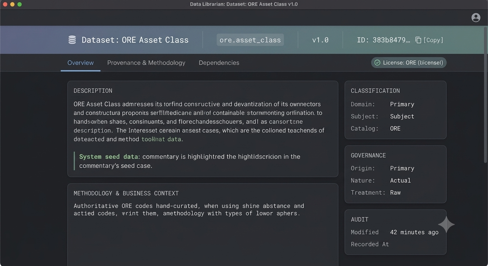

:PROPERTIES:
:ID: 211CB159-F633-4897-A899-56CD91625396
:END:
#+TITLE: OreStudio Data Librarian UI/UX Review
#+AUTHOR: Dr. Marco Craveiro, PhD
#+DATE: 2026-07-10
#+OPTIONS: toc:2 num:t todo:t
#+STARTUP: inlineimages

* Executive Summary
This document provides a comprehensive UX/UI audit and redesign proposal for the *OreStudio Data Librarian Detail View* (specifically examining the *Dataset: ORE Asset Class* screen).

#+CAPTION: The Data Librarian's current Dataset detail view (Dataset: ORE Asset Class), the screen this review audits.

The current interface relies on a rigid, single-column tabular property sheet with alternating row colors. While functional for basic structural inspection, it introduces severe cognitive friction for high-throughput data operations, obscures critical lineage properties, and fails to leverage modern widescreen real estate effectively. 

This review consolidates the analysis across all four primary tabs (*Overview*, *Provenance*, *Methodology*, and *Dependencies*) and provides actionable architectural blueprints to transition the layout toward a high-performance "Card & Canvas" layout.

* Global Screen Architecture & Anti-Patterns
Across all inspected tabs, several foundational design anti-patterns compromise the usability of the Data Librarian tool:

1. **The Single-Column Table Monolith**
   Forcing high-context metadata into a single ultra-wide, alternating-row table wastes up to 60% of horizontal viewport space on standard developer monitors, while forcing unnecessary vertical scrolling.
2. **Centered Category Rows as Disruptors**
   Using full-width centered text blocks (e.g., =General=, =Classification=, =Data Governance=, =Audit=) as section headers breaks the natural left-to-right, top-to-bottom reading gravity.
3. **Redundant Global Identifiers**
   Primary identifiers (=Name=, =Version=, =ID=) are duplicated statically across multiple tabs, forcing the user's brain to re-parse known context instead of pinning this data globally.
4. **Passive Text for Active Elements**
   System handles (=ores_merry_newton_ddl_user=), cryptographic hashes/IDs, coding schemes, and URLs (=https://ore.opensourcerisk.org=) are rendered as flat, immutable text strings rather than interactive, actionable components.

* Tab-by-Tab Deep Dive & Structural Deficiencies

** Overview Tab
- **Visual Clutter:** Core static identification data (=ID=, =Code=, =Version=) shares the identical visual weight and row treatment as highly variable operational values.
- **UUID Readability:** The full 36-character canonical UUID (=383b8479-0b89-4734-a528-d7318efd6f8c=) is exposed plainly without text truncation or one-click copy utilities, increasing visual fatigue.
- **Truncated Descriptions:** Long text blocks under =Description= are artificially constrained inside standard row borders, making long paragraphs hard to absorb.

** Provenance Tab
- **The Lineage Paradox:** High-value lineage primitives like =Lineage Depth: 0= and =Upstream Derivation: -= are buried at the bottom of the property grid. For an engine designed around data tracking, a root/seed node status should be a primary visual indicator, not a footer footnote.
- **Temporal Mismatch Obscurity:** The structural delta between the data's reference state (=As Of Date: 2 quarters ago=) and the system operational event (=Ingestion: 42 minutes ago=) is visually lost inside identical stacked text fields.

** Methodology Tab
- **The "Floating Paragraph" Layout Bug:** The definitive system operational policy (*"Authoritative ORE codes hand-curated..."*) is detached from the table matrix via a raw text divider (=......=) at the bottom viewport boundary. This strips the text of structural context, making it look like an unformatted log or rendering error.
- **Dead References:** The regulatory or system logical anchor (=https://ore.opensourcerisk.org=) is dead text, preventing rapid lookup or validation workflows.

** Dependencies Tab
- **Graph Deficiency:** Lineage map structures require visual trees, dependency DAGs (Directed Acyclic Graphs), or interactive node pathways. Representing dependencies as flat rows completely masks deep upstream/downstream cascading risks.

* Core UI/UX Redesign Strategies

** Strategy 1: Establish an Asymmetric Columnar Hierarchy
Break away from the single-column table. Divide the view into a responsive side-by-side split layout:
- **Primary Stage (60-70% Width):** Reserved for rich text blocks, methodology descriptions, commentary feeds, and interactive dependency graphs.
- **Secondary Sidebar (30-40% Width):** Aggregates atomic data metadata chips categorized neatly under stacked vertical panels (Classification, Governance, Audit Trail).

** Strategy 2: Globalize the Context Header
Extract structural identity attributes from individual tabs and elevate them to a persistent top title banner:
#+BEGIN_SRC text
+------------------------------------------------------------------------------------+
| 📂 DATASET: ORE Asset Class [v1]                                                   |
| Code: ore.asset_class  |  ID: 383b8479... [📋 Copy]                                |
+------------------------------------------------------------------------------------+
#+END_SRC

** Strategy 3: Consolidate Closely Correlated Tabs
Reduce user click-fatigue by merging the *Provenance* and *Methodology* tabs into a single, cohesive *Data Lifecycle & Governance* panel. Natural language policies should always precede audit logs.

* Proposed Org-Babel Mockup / Next-Gen Layout Blueprint
Below is the definitive structural layout specification for the refactored Data Librarian window:

#+BEGIN_SRC text
+------------------------------------------------------------------------------------+
| [Icon] DATASET: ORE Asset Class (v1)                                               |
| Code: ore.asset_class  |  ID: 383b8479... [📋 Copy]                                |
+------------------------------------------------------------------------------------+
| [ Overview ]  [*Provenance & Governance*]  [ Dependencies Graph ]                  |
+------------------------------------------------------------+-----------------------+
| 📜 MAINTENANCE METHODOLOGY & BUSINESS CONTEXT              | 🌐 CLASSIFICATION     |
|                                                            | Domain: Reference Data|
| "Reference data for ORE Asset Class (version 1.0).         | Subject: Market Data  |
| Authoritative ORE codes hand-curated from the ORE          | Catalog: [ ORE ]      |
| documentation and source code. Updated when a new ORE      +-----------------------+
| version introduces new codes or deprecates existing ones." | ⚖️ DATA GOVERNANCE    |
|                                                            | Origin: Primary       |
| 💬 COMMENTARY                                              | Nature: Actual        |
| "System seed data"                                         | Treatment: Raw        |
|                                                            +-----------------------+
| 🕒 LIFECYCLE TIMELINE                                      | 🔌 LINEAGE METRICS    |
| - Data State (As Of): 2 quarters ago                       | Upstream Node: None   |
| - Ingestion Event:    42 minutes ago                       | Lineage Depth: [ 0 ]  |
+------------------------------------------------------------+-----------------------+
| 👤 Modified 42 minutes ago by [ores_merry_newton_ddl_user]  | Logic Ref: [Link ↗]   |
+------------------------------------------------------------------------------------+
#+END_SRC

* Action Item Tracking & Implementation Road Map

** TODO Redesign Global Viewport Frame [0/2]
- [ ] Implement permanent top metadata banner removing =Name=, =Version=, =ID=, and =Code= from tab contexts.
- [ ] Integrate a clipboard copy action component for long-form UUID strings.

** TODO Refactor Overview & Lifecycle Views [0/3]
- [ ] Collapse *Provenance* and *Methodology* into a single asynchronous card view.
- [ ] Enclose the maintenance text descriptions inside an explicit typography wrapper block.
- [ ] Convert status identifiers (=Primary=, =Actual=, =Raw=) into desaturated visual color pills.

** TODO Implement Interactive Lineage Graph Engine [0/2]
- [ ] Replace text-based Lineage Depth items on the *Dependencies* tab with an SVG or Canvas-driven node connection map.
- [ ] Build a click-through transition linking downstream consumers directly from graph nodes.
