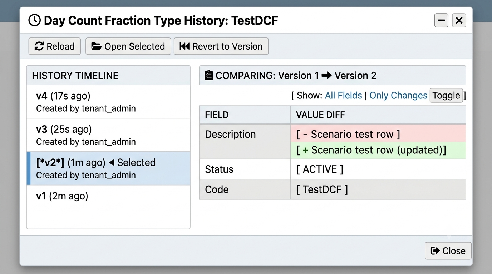

:PROPERTIES:
:ID: 34D92C7A-4714-47CF-852C-0B236F6E1161
:END:
#+TITLE: Gemini Review: History Dialog UI/UX
#+AUTHOR: Gemini AI
#+DATE: 2026-07-12
#+OPTIONS: toc:2 num:t todo:t
#+STARTUP: inlineimages

#+CAPTION: Gemini's proposed history dialog redesign mockup vs. the current widget.

* Executive Summary

The history dialog's core objective is to give users a simple,
immediate way to see what changed between versions. Today it is a
rigid database log view: the screen has massive dead zones (the huge
empty space to the right of the version history list), and the
actual delta is hidden inside flat "Old Value" / "New Value" table
rows the user must cross-examine by hand.

The proposed redesign shifts it to an interactive, "Git-style"
version comparison tool: a master-detail split with a live diff
viewer, semantic diff colouring, and a compressed, timeline-style
version list.

* Redesign Strategies

** 1. Side-by-Side Diffing

Instead of forcing the user to read an "Old Value" column and
cross-examine it against a "New Value" column on the same row:

- *Live Diff Viewer:* Use the current dead right-hand panel as a
  live diff view. Clicking a version row instantly renders the
  comparison there.
- *Semantic colour highlighting:* classic visual diff markers —
  light red background with strikethrough for deleted data, light
  green background for added/modified data.
- *Inline word diffing:* highlight only the changed span within a
  field's value (e.g. =Scenario test row= *(+updated)*) instead of
  requiring the user to re-read the whole string.

** 2. Multi-Version Selection (Compare Mode)

Today the user selects one version and sees only what changed in
that specific release. Often they need the delta between two
arbitrary versions (e.g. version 1 vs version 4) directly.

- *Multi-select:* allow checking two distinct version rows in the
  left-hand list.
- *"Compare Selected" action:* recomputes the diff panel to show the
  net change across the two chosen snapshots, rather than only
  sequential single-step diffs.

** 3. Layout Hierarchy & Dead Space

- *Master-detail split:*
  - Left (~30% width): the vertical version timeline — keep
    version, recorded-at, and commentary; compress long technical
    strings (e.g. a service account name like
    =ores_prime_origin_refdata_service=) behind a hover tooltip or
    badge.
  - Right (~70% width): the expansive diff panel.
- *Collapse the lower pane:* folding the layout this way removes the
  awkward middle =Changes= / =Full Details= tab row entirely — toggle
  "Only Changes" vs "Full View" via a segmented control inside the
  diff pane's own header instead.

** 4. Visual Timeline Polish

- *Version "pill" badges:* replace the flat row number with styled
  badges (=v4=, =v3=, =v2=, ...).
- *Connecting line:* draw a thin vertical line linking the version
  markers in the history list, reinforcing the "git graph" metaphor
  that these events are a sequential timeline.

* Refactored Interface Concept

#+begin_example
+------------------------------------------------------------------------------------+
| Day Count Fraction Type History: TestDCF                                    [-] [X]|
+------------------------------------------------------------------------------------+
| [Reload]  [Open Selected]  [Revert to Version]                                     |
+--------------------------------------+---------------------------------------------+
| HISTORY TIMELINE                     | COMPARING: Version 1 -> Version 2           |
+--------------------------------------+  [ Show: All Fields | Only Changes Toggle ] |
|  v4  (17s ago)                       +---------------------------------------------+
|  - By: tenant_admin                  | FIELD        VALUE DIFF                     |
|  |                                   +---------------------------------------------+
|  v3  (25s ago)                       | Description  [ - Scenario test row        ] |
|  - By: tenant_admin                  |              [ + Scenario test row (updated)]|
|  |                                   |              |                              |
| [*v2*] (1m ago)  <- Selected         | Status       [   ACTIVE                   ] |
|  - By: tenant_admin                  |              |                              |
|  |                                   | Code         [   TestDCF                  ] |
|  v1  (2m ago)                        |              |                              |
+--------------------------------------+---------------------------------------------+
|                                                                            [Close] |
+------------------------------------------------------------------------------------+
#+end_example

* See also

- [[id:037B474D-84ED-4888-9054-D58AB1FB10D2][Consolidate history dialogs onto HistoryDialogBase]] — the story
  this review's redesign work is tracked under.
