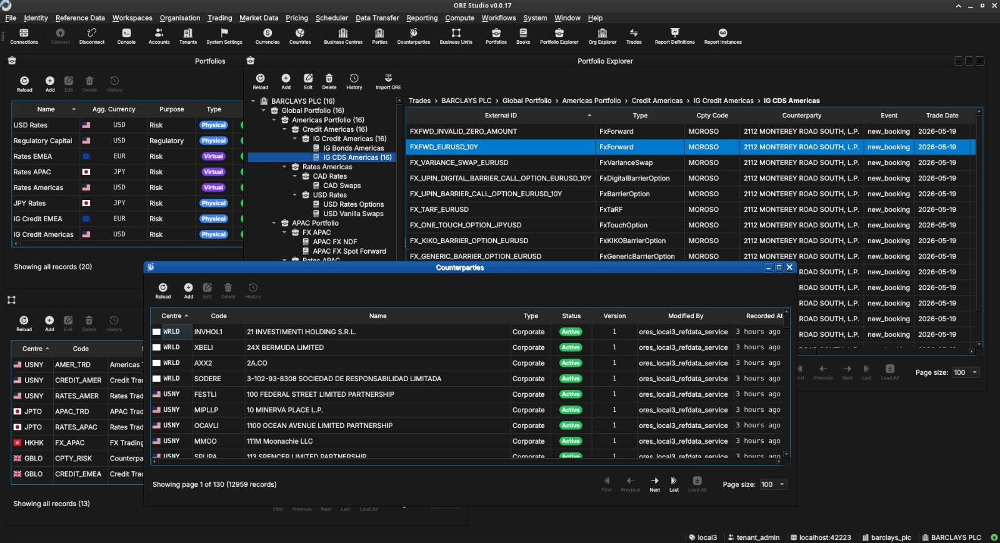

:PROPERTIES:
:ID: 2F71292F-CDB0-4E2E-B50F-4F02E10597C4
:END:
#+title: Product Identity
#+description: C++ application built on QuantLib and Acadia's Open Source Risk Engine (ORE), providing persistent database storage, a Qt GUI for data generation and exploration, and ORE execution orchestration.
#+type: product_identity
#+level: s5
#+filetags: :identity:vision:
#+created: 2026-05-21
#+updated: 2026-06-05

This is the [[id:436FB40C-422A-465B-B949-E9F0760820C1][product identity]] of ORE Studio — the [[id:6DF00A64-7CC3-40A7-950B-55D2B05A31C7][System 5]] document in our
[[id:926B916E-A57E-498E-99AB-720B583C0362][cybernetic information architecture]], where identity is the durable policy layer
that constrains every level below it. It is the statement of what the product
/is/ and what it /is not/; it predates any [[id:37C10313-E6E9-4D42-B82D-B6758D0A3AD9][version]] and outlives every release.
Everything else under =doc/= — [[id:0820B7FD-147C-4832-AC25-C043D38D5B61][sprints]], [[id:699A8D45-B67E-4D3E-9206-24FA17C51ADA][stories]], [[id:31C868B9-306E-4282-BA8C-07E647021B34][tasks]], [[id:671F18E4-E09C-4B3B-BD24-D33DF8AE38A6][captures]] — is filtered
through this page when deciding whether a candidate idea belongs in the [[id:D4219199-7B17-4A89-B4BC-6019738642DA][product
backlog]] at all.

#+caption: ORE Studio v0.0.17 — the main window, an early implementation of the vision below.

* Vision

Here we define the vision for the product — what guides us when we think about
ORE Studio and what can and cannot go into the [[id:D4219199-7B17-4A89-B4BC-6019738642DA][product backlog]]. Vision is one
facet of identity: it states what we are building /toward/.

** Vision statement

The vision for ORE Studio is to build on top of Acadia's [[id:1CBDEA40-5FAE-4F04-BD21-2BB29172B5AA][Open
Source Risk Engine (ORE)]], which itself builds on [[id:0412444A-0A4C-4611-887C-09353A3CB253][QuantLib]], with the
aim of providing:

- a persistent database storage for all of its inputs and outputs;
- a graphical user interface both for data generation as well as data
  exploration;
- the ability to configure and orchestrate ORE execution.

** Vision quote

#+begin_quote
People think focus means saying yes to the thing you've got to focus on. But
that's not what it means at all. It means saying no to the hundred other good
ideas that there are. You have to pick carefully. I'm actually as proud of the
things we haven't done as the things I have done. Innovation is saying no to
1,000 things. — Steve Jobs
#+end_quote

* Audience

ORE Studio exists to lower the barrier to learning quantitative finance
through hands-on building. The primary barriers are /access/: real market
data is proprietary and expensive; production quant models live inside
institutional systems; the infrastructure of an enterprise risk platform
tends to obscure rather than reveal the underlying domain. ORE Studio
addresses these by providing synthetic and generated market data,
delegating all quantitative mathematics to [[id:1CBDEA40-5FAE-4F04-BD21-2BB29172B5AA][ORE]] and [[id:0412444A-0A4C-4611-887C-09353A3CB253][QuantLib]], and keeping
the architecture intentionally simple (client → service layer → Postgres)
so that domain concepts stay visible rather than buried.

The target is the software developer — moderately fluent in C++ or a
similar systems language — who wants to understand how computational
finance works by building and extending a real system. Not by reading
textbooks, not by running spreadsheets: by modifying code, running [[id:1CBDEA40-5FAE-4F04-BD21-2BB29172B5AA][ORE]],
and observing what changes. A secondary audience is the developer already
familiar with [[id:1CBDEA40-5FAE-4F04-BD21-2BB29172B5AA][ORE]] or [[id:0412444A-0A4C-4611-887C-09353A3CB253][QuantLib]] who wants a graphical environment for
exploration and experimentation.

ORE Studio is /independent of/ both [[id:1CBDEA40-5FAE-4F04-BD21-2BB29172B5AA][ORE]] and [[id:0412444A-0A4C-4611-887C-09353A3CB253][QuantLib]] and has no
affiliation with either project or any financial institution.

* Out of scope

What ORE Studio /is not/ — equally important to what it is.

- A professional, enterprise-grade risk system. ORE Studio follows Karpathy's
  "learning is enmeshed with the act of building" principle; production-grade
  performance, multi-user features, and cloud deployment are explicitly out of
  scope.
- A reimplementation of ORE or QuantLib. ORE Studio wraps them; their models,
  conventions, and limitations are inherited as-is.
- A pricing or risk authority. Numbers come from ORE / QuantLib; ORE Studio is
  the surface through which they flow.

* Relationship to versions and milestones

The product identity is durable. [[id:37C10313-E6E9-4D42-B82D-B6758D0A3AD9][Versions]] and [[id:C540506E-7129-4CF2-AE3E-6C8BB9C9417F][milestones]] are not. [[id:E6FD30ED-963E-4705-B414-91BF471C23D0][v0]]
establishes the shape; =v1.0= and beyond will extend it. When something in this
document changes, that is a re-identification — not a version bump.

See the [[id:C4246E9D-D0AD-495C-943D-4200CFC17676][Roadmap]] for the user-facing narrative of where the product is and
where it is going, [[id:37C10313-E6E9-4D42-B82D-B6758D0A3AD9][Versions]] for the running list of versions that have
implemented this identity, and [[id:C540506E-7129-4CF2-AE3E-6C8BB9C9417F][Milestones]] for the major release targets
bounding each version series.
