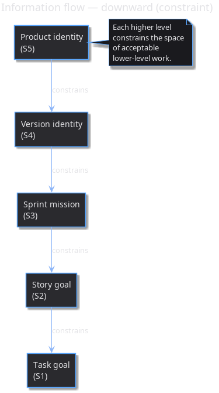
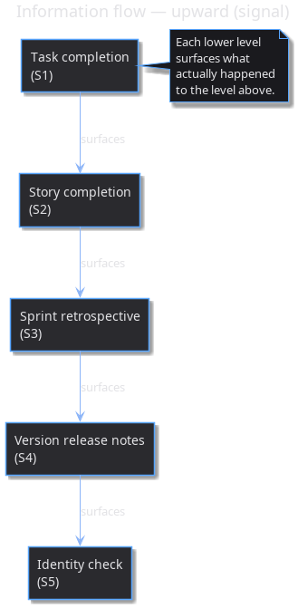
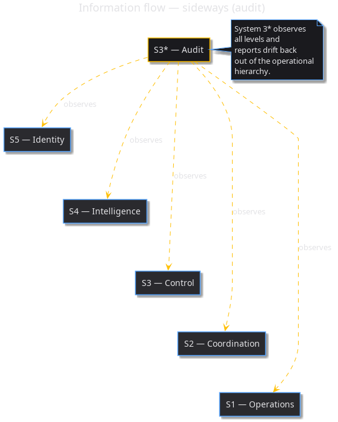

:PROPERTIES:
:ID: 926b916e-a57e-498e-99ab-720b583c0362
:END:
#+title: Cybernetic Levels
#+description: Definitions of System 1–5, what each is responsible for, and how they interact.
#+type: meta
#+version: 2
#+level: cross
#+filetags: :meta:cybernetics:levels:
#+created: 2026-05-18
#+updated: 2026-05-21

This page applies ideas from [[https://en.wikipedia.org/wiki/Cybernetics][cybernetics]] — specifically Stafford Beer's Viable
System Model — to ORE Studio. There are five levels (S1 to S5) that separate
/concerns/ across time horizons: from the agent running one task right now (S1)
to the durable identity of the product as a whole (S5). In addition there is an
independent audit channel — written *S3** and pronounced "three-star" to
distinguish it from the operational S3 /control/ role; the two sit at the same
level in Beer's model but do different jobs. A stateful document is tagged with
the level it serves (=#+level:= frontmatter), so all artefacts of a given level
are findable with one grep. The levels are not a strict hierarchy of authority —
they are a separation of concerns. Higher levels do not override lower ones;
they /constrain/ them.

* System 1: Operations
:PROPERTIES:
:ID: dbfd530b-4b56-48d1-9f03-3a0d0da16552
:END:

In Beer's VSM, /System 1/ is the operational unit that interacts directly with
its environment to do the work. In ORE Studio it is the agent at the keyboard: a
subprocess that picks up a single task, implements it, and merges a PR.
Everything above S1 only exists to keep S1 fed with coherent, well-scoped work.

#+ATTR_HTML: :class hug-leading
| Field                 | Value                                                                                                                                                                                        |
|-----------------------+----------------------------------------------------------------------------------------------------------------------------------------------------------------------------------------------|
| Scope                 | A single task.                                                                                                                                                                               |
| Time horizon          | Hours to a day.                                                                                                                                                                              |
| Thinks about          | How to implement /this/ task within its size budget.                                                                                                                                         |
| Executor              | An agent (subprocess) spawned by an orchestrator.                                                                                                                                            |
| Inputs                | A task document and the codebase.                                                                                                                                                            |
| Outputs               | A PR, an updated task document marked done, any discovered tasks filed for triage.                                                                                                           |
| Owns                  | The implementation of the task. Nothing more.                                                                                                                                                |
| Lifecycle touchpoints | Runs the [[id:227958a5-0f78-4cc6-a116-b83988592b68][Sprint execution]] phase — claims =BACKLOG= tasks, transitions them through =STARTED= / =BLOCKED= / =DONE=, opens and lands one PR per task. Files [[id:4ea506f5-c3e9-4f92-8024-a5eed0b3df43][discovered tasks]] for S2 to triage. |
| Function              | [[id:b544713a-ba23-4d5a-9cee-084212d7c8ba][S1 Agent]] — load this doc when taking on the S1 role.                                                                                                                                                                                |

* System 2: Coordination
:PROPERTIES:
:ID: bf4f183f-bb33-44f2-a53f-d9bd602e9be8
:END:

In Beer's VSM, /System 2/ is the anti-oscillation layer: it coordinates the
operational units below so they don't collide or duplicate work. In ORE Studio
it is the orchestrator LLM the user assigns to a story — it decomposes the story
into tasks, hands them out to S1 agents, reviews what they produce, and decides
what to do with anything discovered along the way.

#+ATTR_HTML: :class hug-leading
| Field                 | Value                                                                                                                                                                                                                                                                                                             |
|-----------------------+-------------------------------------------------------------------------------------------------------------------------------------------------------------------------------------------------------------------------------------------------------------------------------------------------------------------|
| Scope                 | A story and its tasks.                                                                                                                                                                                                                                                                                            |
| Time horizon          | Days.                                                                                                                                                                                                                                                                                                             |
| Thinks about          | How the story decomposes into tasks, what size each task must be, what order they run in, what to do with discovered tasks.                                                                                                                                                                                       |
| Executor              | The orchestrator LLM the user assigned to the story.                                                                                                                                                                                                                                                              |
| Inputs                | A story document, the sprint mission, the codebase.                                                                                                                                                                                                                                                               |
| Outputs               | Tasks, decisions, review of agent output, story completion.                                                                                                                                                                                                                                                       |
| Owns                  | Scoping, task sizing, in-story prioritisation, review.                                                                                                                                                                                                                                                            |
| Lifecycle touchpoints | Decomposes promoted stories into tasks during [[id:f5426198-acaf-41da-a043-ff15785e4a1d][Sprint planning]]; reviews S1 output and triages discovered work during [[id:227958a5-0f78-4cc6-a116-b83988592b68][Sprint execution]]; resolves each story (=DONE= / =ABANDONED= / carried) during [[id:7d72a9da-984f-4130-bff6-97b66b233907][Sprint closure]]. Also files captures into the [[id:d4219199-7b17-4a89-b4bc-6019738642da][product backlog]] when discovered work cannot fit any current story. |
| Function              | [[id:eeca6981-3240-44d9-ada7-4b8c64a76b44][S2 Orchestrator]] — load this doc when taking on the S2 role.                                                                                                                                                                                                                                                            |

* System 3: Control
:PROPERTIES:
:ID: 8f13ba75-edaa-46cc-9be2-e356d60bf4f4
:END:

In Beer's VSM, /System 3/ is operational management — it allocates resources to
S1, integrates S2's coordination signals, and keeps the whole operational layer
running coherently. In ORE Studio it is the sprint planner: a session invoked
when a sprint opens or closes, that decides which stories the sprint will pursue
and verifies they cohere around one mission.

#+ATTR_HTML: :class hug-leading
| Field                 | Value                                                                                                                                                                                                                                                                                                      |
|-----------------------+------------------------------------------------------------------------------------------------------------------------------------------------------------------------------------------------------------------------------------------------------------------------------------------------------------|
| Scope                 | The current sprint, with awareness of the previous and next.                                                                                                                                                                                                                                               |
| Time horizon          | Weeks.                                                                                                                                                                                                                                                                                                     |
| Thinks about          | Does the set of stories in the sprint cohere with the sprint mission? Are short-term hacks accumulating? Are sprints linear in intent? Are discovered stories being triaged?                                                                                                                               |
| Executor              | A session invoked on demand by the user.                                                                                                                                                                                                                                                                   |
| Inputs                | The sprint backlog, completed sprints, current sprint mission.                                                                                                                                                                                                                                             |
| Outputs               | Sprint planning, story prioritisation, retrospectives.                                                                                                                                                                                                                                                     |
| Owns                  | Medium-term planning, sprint coherence.                                                                                                                                                                                                                                                                    |
| Lifecycle touchpoints | Drives the entire [[id:46dfe47f-967b-4c24-95bf-3e21f97cfd20][sprint phases]] sequence — refines the [[id:d4219199-7b17-4a89-b4bc-6019738642da][product backlog]] continuously, defines the sprint mission and chooses stories in /Sprint planning/, generates release notes and runs the post-mortem in /Sprint closure/, and decides when a near→far demotion or far→near promotion is appropriate. |
| Function              | [[id:f1d99662-c6b1-4839-92e1-d061ccf6b83f][S3 Sprint Planner]] — load this doc when taking on the S3 role.                                                                                                                                                                                                                                                              |

* System 3*: Audit
:PROPERTIES:
:ID: ed29c99b-1507-49c9-9937-d296fffe428e
:END:

In Beer's VSM, /System 3*/ ("three-star") is the independent audit channel — it
watches the operational layer from the outside to catch drift the inside cannot
see. In ORE Studio it is scheduled scripts plus an occasional session: invariant
checks that the docs and code say what they should, run continuously rather than
per sprint.

#+ATTR_HTML: :class hug-leading
| Field                 | Value                                                                                                                                                                                                                                                           |
|-----------------------+-----------------------------------------------------------------------------------------------------------------------------------------------------------------------------------------------------------------------------------------------------------------|
| Scope                 | The whole information architecture.                                                                                                                                                                                                                             |
| Time horizon          | Continuous.                                                                                                                                                                                                                                                     |
| Thinks about          | Are invariants holding? Orphan tasks, stale recipes, broken links, completed work not linked to PRs, plans that outlived their task.                                                                                                                            |
| Executor              | Scheduled scripts plus a session invoked on demand.                                                                                                                                                                                                             |
| Inputs                | Every document under =doc/=.                                                                                                                                                                                                                                    |
| Outputs               | Audit reports, automatic state corrections, tasks to fix drift.                                                                                                                                                                                                 |
| Owns                  | The integrity of the system itself.                                                                                                                                                                                                                             |
| Lifecycle touchpoints | Observes the heartbeat invariant during [[id:227958a5-0f78-4cc6-a116-b83988592b68][Sprint execution]] (=STARTED= / =BLOCKED= staleness), checks every id-link resolves, audits =DISCOVERED= tasks that overstay one orchestrator session, verifies predecessor / successor symmetry on cross-sprint stories. |
| Function              | [[id:049b086e-f131-4d7a-8244-c1b2ff297ab6][S3* Auditor]] — load this doc when taking on the S3* role.                                                                                                                                              |

* System 4: Intelligence
:PROPERTIES:
:ID: 6ca8b181-bd81-4ef4-af27-64f5491d62f0
:END:

In Beer's VSM, /System 4/ is the outward-looking, strategic layer — it watches
the environment over a longer horizon and asks "where is this going?". In ORE
Studio it is the version planner: a session that checks whether the sequence of
sprints adds up to the version mission and intervenes when it doesn't.

#+ATTR_HTML: :class hug-leading
| Field                 | Value                                                                                                                                                                                                                                                                                    |
|-----------------------+------------------------------------------------------------------------------------------------------------------------------------------------------------------------------------------------------------------------------------------------------------------------------------------|
| Scope                 | The current major version.                                                                                                                                                                                                                                                               |
| Time horizon          | Months.                                                                                                                                                                                                                                                                                  |
| Thinks about          | Does the sequence of sprints lead to a coherent release? Are there sprints missing? Is the version's identity being eroded?                                                                                                                                                              |
| Executor              | A session invoked on demand by the user.                                                                                                                                                                                                                                                 |
| Inputs                | The version identity, the sprint sequence, the product identity.                                                                                                                                                                                                                         |
| Outputs               | Version plan, sprint sequencing, release scope decisions.                                                                                                                                                                                                                                |
| Owns                  | Medium-to-long-term planning.                                                                                                                                                                                                                                                            |
| Lifecycle touchpoints | Cross-checks each sprint's mission against the version mission during [[id:f5426198-acaf-41da-a043-ff15785e4a1d][Sprint planning]]; participates in /release cut/ decisions during [[id:7d72a9da-984f-4130-bff6-97b66b233907][Sprint closure]] (whether to publish a release or land mid-version); responsible for moving captures near↔far when the next version's focus changes. |
| Function              | [[id:66eb6824-52b8-4603-b302-f805da9ec443][S4 Version Planner]] — load this doc when taking on the S4 role.                                                                                                                                                                                                                                                |

* System 5: Policy / Identity
:PROPERTIES:
:ID: 6df00a64-7cc3-40a7-950b-55d2b05a31c7
:END:

In Beer's VSM, /System 5/ is the policy layer — it carries the identity of the
organism, the durable answer to "what are we?". In ORE Studio it is the [[id:2f71292f-cdb0-4e2e-b50f-4f02e10597c4][product
identity]] doc and the sessions that maintain it; everything below S5 is filtered
through that identity when deciding what counts as "ORE Studio" at all.

#+ATTR_HTML: :class hug-leading
| Field                 | Value                                                                                                                                                                                                                                                                   |
|-----------------------+-------------------------------------------------------------------------------------------------------------------------------------------------------------------------------------------------------------------------------------------------------------------------|
| Scope                 | The product as a whole.                                                                                                                                                                                                                                                 |
| Time horizon          | Indefinite.                                                                                                                                                                                                                                                             |
| Thinks about          | Is this idea ORE Studio or not? Does a proposed version fit the product? Is a far story in scope?                                                                                                                                                                       |
| Executor              | A session invoked on demand, usually with the user collaborating.                                                                                                                                                                                                       |
| Inputs                | The product identity, candidate versions, candidate far stories.                                                                                                                                                                                                        |
| Outputs               | Identity updates, scope decisions (accept / reject / defer), out-of-scope notes.                                                                                                                                                                                        |
| Owns                  | What ORE Studio /is/ and /is not/.                                                                                                                                                                                                                                      |
| Lifecycle touchpoints | Filters story choice during [[id:f5426198-acaf-41da-a043-ff15785e4a1d][Sprint planning]] (does each candidate fit the [[id:2f71292f-cdb0-4e2e-b50f-4f02e10597c4][product vision]]?); reviews [[id:d4219199-7b17-4a89-b4bc-6019738642da][backlog]] captures for identity-fit and decides accept (the capture stays in near/far) or reject (the capture is deleted, with the rationale noted in commit history). |
| Function              | [[id:5cad21da-21fb-460b-9286-8998b4c6ef52][S5 Identity Steward]] — load this doc when taking on the S5 role.                                                                                                                                                                                                                                                                            |

* Information flow

Information moves through the levels in three directions: /downward/
as constraint (higher levels narrowing the space of acceptable lower
work), /upward/ as signal (lower levels reporting what actually
happened), and /sideways/ as audit (S3* observing the whole stack
from outside).

** Downward — constraint

Identity → version identity → sprint mission → story goal → task
goal. Each higher level constrains the space of acceptable
lower-level work.

#+caption: Constraint flowing downward through the cybernetic levels.

** Upward — signal

Task completion → story completion → sprint retrospective → version
release notes → identity check. Each lower level surfaces what
actually happened to the level above.

#+caption: Signal flowing upward through the cybernetic levels.

** Sideways — audit

System 3* observes all levels and reports drift back outside the
operational hierarchy.

#+caption: S3* audit observes all five levels from outside the operational hierarchy.

