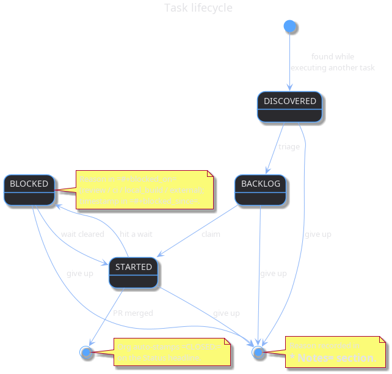

:PROPERTIES:
:ID: 8810e0f9-c5b9-4cfa-a710-774ad6c771dd
:END:
#+title: Lifecycle
#+description: State transitions for every stateful document type, as TODO keyword changes on the Status headline.
#+type: meta
#+version: 2
#+level: cross
#+filetags: :meta:lifecycle:state:
#+created: 2026-05-18
#+updated: 2026-05-21

This document is the generic state machine that applies to every
stateful v2 document — [[id:31c868b9-306e-4282-ba8c-07e647021b34][tasks]], [[id:699a8d45-b67e-4d3e-9206-24fa17c51ada][stories]], [[id:0820b7fd-147c-4832-ac25-c043d38d5b61][sprints]], and [[id:ca4d4bde-2eab-4f0a-bc8b-7c0bcb17bc82][versions]]. It
defines what each TODO keyword means, the legal transitions between
them, and the rules audit uses to verify the system is healthy. It
is /not/ agile-specific (the rhythm /around/ these states lives in
[[id:46dfe47f-967b-4c24-95bf-3e21f97cfd20][Agile process]]) and it is /not/ document-type-specific (per-type
frontmatter and section requirements live in [[id:8b29a8d8-e004-4e87-b81d-abeaf68f2b98][Document types]]).

* Principle

State lives /inside/ the document, as the TODO keyword on the
=* Status= headline. The folder structure encodes composition only —
which version, sprint, story, or task the document belongs to. Folders
never carry state.

Transitions are TODO keyword changes (one edit, or =C-c C-t= in emacs).
Org auto-stamps the transition in the headline's =LOGBOOK= and adds
=CLOSED:= when entering a terminal state.

* Task lifecycle

TODO vocabulary: =DISCOVERED BACKLOG STARTED BLOCKED | DONE ABANDONED=.

Source: [[./task_lifecycle.puml][=task_lifecycle.puml=]]. Regenerate with
=plantuml -tpng doc/meta/task_lifecycle.puml=.

Meaning of each state:

- =DISCOVERED= :: spotted in passing while executing another task; not
  yet triaged. Minimum content: title, description, link back to the
  discovering task.
- =BACKLOG= :: triaged into a story, scheduled but not started.
- =STARTED= :: an agent or human is actively working on it. =#+owner=
  identifies them.
- =BLOCKED= :: paused waiting on review, CI, a local build, or anything
  external. The reason lives in =#+blocked_on=; the timestamp in
  =#+blocked_since=. =BLOCKED= is a real state, not just an attribute —
  agenda views and audits treat it distinctly from =STARTED=.
- =DONE= :: PR merged. Task document updated with =* Result=. Org has
  stamped =CLOSED:= on the Status headline.
- =ABANDONED= :: explicitly dropped. Must record /why/ in the
  =* Notes= section.

** Where a discovered task physically lives

If the discovered task is logically related to the current story, it is
filed in-place under that story with state =DISCOVERED=:

#+begin_example
versions/v0/sprint_NN/<current_story>/<discovered_task_slug>/task.org
#+end_example

If it does not fit the current story (or any active story), it goes to
the sprint-level inbox:

#+begin_example
versions/v0/sprint_NN/inbox/<discovered_task_slug>/task.org
#+end_example

The orchestrator (System 2) makes this classification when filing the
task. Triage promotes the file to =BACKLOG= and, for inbox tasks, moves
the folder under the story that eventually claims it.

** Triage rule

Discovered tasks must leave =DISCOVERED= within one System 2 session of
the story or sprint they were discovered in. They move to: =BACKLOG=
(claimed by the same story), =BACKLOG= under a different story (folder
move), the product backlog (as a /far/ story candidate), or =ABANDONED=
with a reason.

* Story lifecycle

TODO vocabulary: =BACKLOG STARTED | DONE ABANDONED=.

Transitions:

- =BACKLOG → STARTED= :: the sprint claims the story (the user assigns
  it to an orchestrator).
- =STARTED → DONE= :: every task in the story is =DONE=, =ABANDONED=,
  or has been explicitly moved to a future story (with a recorded
  reason in =* Notes=).
- =* → ABANDONED= :: the story is dropped. Record why in
  =* Decisions=.

** Cross-sprint stories

A story belongs to exactly one sprint. When work does not fit, the
preferred pattern is /not/ to drag the story across sprints but to
close it in the current sprint and continue under a new story in the
next:

1. At sprint close, the story in sprint N moves to =DONE= reflecting
   whatever landed. Tasks that didn't make it are either moved to the
   successor's =BACKLOG= or recorded in the predecessor's
   =* Out of scope=.
2. A successor story is created in sprint N+1 with:
   - A fresh =:ID:= and a slug suffixed with =_continued= or =_phase_2=.
   - =#+predecessor: <id-of-prior-story>= frontmatter.
   - A =Continued from: [[id:...][...]]= line under the parent-sprint
     link.
3. The predecessor is updated:
   - =#+successor: <id-of-successor-story>= frontmatter.
   - A =Continued in: [[id:...][...]]= note in =* Decisions=.

The same pattern applies across version boundaries.

Tasks /can/ carry over in practice (an attempted task in sprint N
finishes in sprint N+1). The task itself lives where it finished; we
don't track per-task predecessor links. If the original attempt was
substantial enough to matter, it is mentioned in the task's =* Notes=.

Discovered work that doesn't fit /either/ the current sprint or the
next goes to the product backlog rather than into a sprint. System 3
(sprint planning) pulls it into a sprint when it fits.

* Sprint lifecycle

TODO vocabulary: =STARTED | DONE=.

A sprint is =STARTED= while it is the current sprint (the
lexicographically highest =sprint_NN/= folder under the version).
Closing a sprint requires:

- The =* Retrospective= section filled.
- The release notes generated (if applicable).
- TODO state moved to =DONE=.

No =BACKLOG= for sprints: a sprint exists when its folder exists.
Future sprints are not pre-allocated.

The /process/ a sprint goes through — planning (define mission,
choose stories, decompose), execution (run tasks), closure (release
notes, release, post-mortem) — is detailed in
[[id:46dfe47f-967b-4c24-95bf-3e21f97cfd20][agile process / Sprint phases]]. The state machine here is just the
two endpoints those phases bracket.

* Version lifecycle

TODO vocabulary: =STARTED | RELEASED=.

A version is =STARTED= while it is the active version (one at a time).
On release, TODO moves to =RELEASED= and a release note is generated.

* Plan lifecycle

Plans are not on a TODO. They live as a =* Plan= section /inside/ the
task or story document. (Tasks are flat files, not folders, so there
is no separate =plan.org=.)

- Created when System 1 or System 2 needs to think before acting.
- Closed when the task lands: decisions distil into the parent story's
  =* Decisions= section. The =* Plan= section is then cleared or
  summarised into =* Notes=. Plans /must not/ outlive their task.

* Knowledge, recipes, functions

Not stateful by TODO. Audit may attach a =:stale:= tag for review, but
these documents do not change state through the lifecycle machinery.

* What audit checks

- Every stateful document has a =* Status= headline with a valid TODO
  keyword from its document type's vocabulary.
- =DISCOVERED= tasks are no older than one System 2 session.
- =STARTED= and =BLOCKED= tasks have =#+owner=, =#+branch=, and
  =#+blocked_on= set. =BLOCKED= additionally has =#+blocked_since= no
  older than a configurable threshold.
- =#+updated= is fresh for any task in =STARTED= or =BLOCKED= (the
  heartbeat).
- No plans survive the closure of their parent task.
- =STARTED= stories have at least one task in =STARTED=, =BLOCKED=, or
  =DONE= within the last N days.
- Every id-link resolves.
- For every story carrying =#+predecessor=, the target story has a
  matching =#+successor= pointing back (and vice versa).
