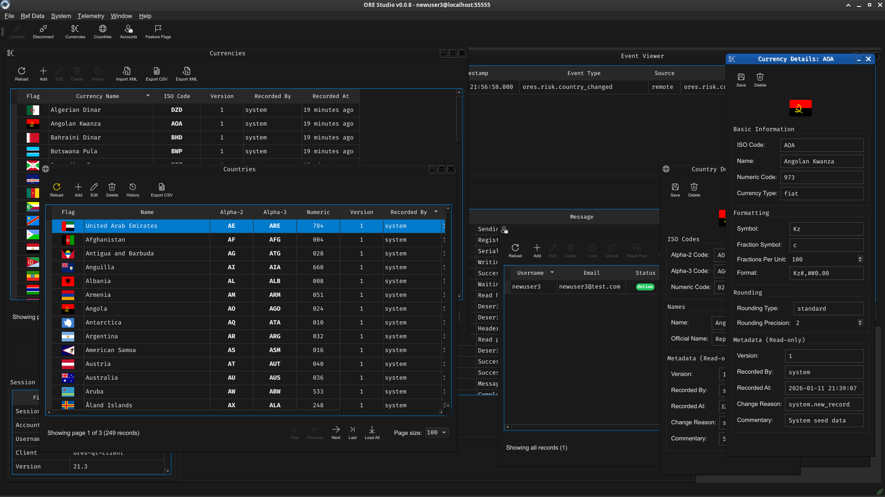

:PROPERTIES:
:ID: D04D3476-D7C5-3954-A33B-C641EBCB43F6
:END:
#+TITLE:      ORE Studio
#+version: 1
#+AUTHOR:     Marco Craveiro et al.
#+EMAIL:      marco.craveiro@gmail.com
#+language:   en
#+startup: inlineimages
#+options: html-postamble:nil toc:nil num:nil ^:nil title:nil
#+HTML_DOCTYPE: html5

#+HTML: <section class="hero">
#+HTML: 
#+HTML: <a class="btn" href="https://github.com/orestudio/OREStudio">Explore on GitHub</a>
#+HTML: <h1>Enterprise-grade risk analytics &mdash; but visual <i>and</i> open-source.</h1>
#+HTML: 
ORE Studio wraps the <a href="https://github.com/OpenSourceRisk">Open-Source Risk Engine</a> (ORE) in an intuitive graphical interface - no Python or C++ required.

#+HTML: </section>

*ORE Studio* is a new and independent open-source project with the goal of
providing a graphical wrapper around Acadia's [[id:1cbdea40-5fae-4f04-bd21-2bb29172b5aa][ORE]]. ORE itself builds on top of
[[id:0412444a-0a4c-4611-887c-09353a3cb253][QuantLib]], the de-facto standard open-source library for quantitative finance.
*ORE Studio* aims to augment ORE's robust analytics to eventually provide full
life-cycle management for all entities within the trading system,
point-and-click reporting, trade modelling and market-data management.

#+ATTR_HTML: :alt ORE Studio Qt User Interface :title ORE Studio Qt User Interface :align center
#+ATTR_HTML: :width 100% :height 100%

#+HTML: 

#+HTML: 

#+HTML: <h3>QuantLib Inside</h3>
#+HTML: 
Benefit from over 20 years of peer-reviewed quantitative-finance models.

#+HTML: 

#+HTML: 

#+HTML: <h3>ORE Powered</h3>
#+HTML: 
Latest pricing and risk analytics including XVAs, sensitivities and regulatory scenarios.

#+HTML: 

#+HTML: 

#+HTML: <h3>Visual Workflow</h3>
#+HTML: 
Manage visually curves, trades and reports. Share results via the reporting management system.

#+HTML: 

#+HTML: 

#+HTML: <footer>
#+HTML: © 2025 ORE Studio contributors.
#+HTML: </footer>
