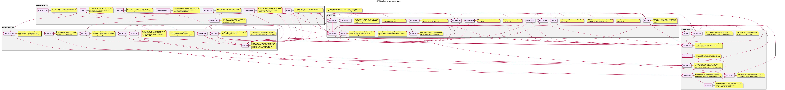

:PROPERTIES:
:ID: D773166D-0C91-8CB4-3323-42166BC07687
:END:
#+title: System Model
#+description: ORE Studio's four-layer architecture (foundation / infrastructure / domain / application) and the components in each layer.
#+type: knowledge
#+version: 2
#+level: cross
#+filetags: :modeling:architecture:system_model:index:
#+created: 2024-06-15
#+updated: 2026-05-26
#+startup: inlineimages

This file documents the architecture of the [[id:D04D3476-D7C5-3954-A33B-C641EBCB43F6][ORE Studio]] system —
what /it is/ and what it's /for/ live in [[id:2F71292F-CDB0-4E2E-B50F-4F02E10597C4][Product identity]]. This
page is the index from which each component's
=component_overview.org= hangs, organised into the four
architectural layers below.

#+attr_html: :class note
#+begin_quote
To operate on the system architecture, see the [[id:37B88704-7A45-4347-A80A-9D9B4EE71BEF][System Architect]] skill.
#+end_quote

* System Architecture

ORE Studio is a four-layer system with a single invariant: a layer may
only depend on layers below it. This constraint is not an accident of
history — it is a deliberate architectural boundary that keeps the
system testable in isolation, replaceable one layer at a time, and
understandable without reading the whole codebase. Every component in
the system belongs to exactly one of these layers:

- *Foundation Layer* — the bedrock. No ORE Studio dependency anywhere
  in this layer. Utilities, platform abstractions, logging, database
  access, cryptography, and code generation live here. If it existed
  before ORE Studio had a domain model, it belongs here.
- *Infrastructure Layer* — communication and testing. Depends only on
  Foundation. NATS messaging, the deprecated binary protocol, and the
  Catch2 integration that isolates every test into its own PostgreSQL
  schema.
- *Domain Layer* — the business. Depends on Foundation + Infrastructure
  but never on Application. Reference data, IAM, trading, market data,
  reporting, data quality — the financial domain model that justifies
  the system's existence.
- *Application Layer* — the surfaces. Depends on every layer below.
  Qt desktop, CLI, HTTP servers, Wt web frontend, and the compute
  engine. If a user touches it, it lives here.

Diagram:

#+attr_html: :width 100% :alt Description
#+caption: ORE Studio System Diagram

** Foundation Layer

Foundation is the layer that has no ORE Studio dependencies — not by
convention, but by design. Every component here could, in principle,
be extracted into a standalone library without pulling in a single ORE
domain type. This is the testability boundary: if you want to verify
that database connectivity or logging works, you do it here, in
isolation, without instantiating a trade or a counterparty. The
dependency order is a chain: utility → platform → logging → telemetry
→ database. Each link adds one capability; none loops back.

| Component | Description | Depends On |
|-----------+-------------+------------|
| [[id:00E33570-F7BE-7F94-FD83-2FDC9CB04463][ores.utility]] | UUID v7 generation, Base64/Base32 encoding, string conversion, datetime helpers, faker utilities, =rfl= type reflectors. | none |
| [[id:7F3A2E81-B5C9-4D6A-8E12-9C4B3F5A7D0E][ores.platform]] | Filesystem utilities, environment variables, network info (hostname, MAC, machine ID), cross-platform time utilities. | utility |
| [[id:1FBCC86B-8E04-4F81-8558-85C0B6C54836][ores.logging]] | Core Boost.Log infrastructure — =make_logger()= factory, severity levels, lifecycle manager for console/file sinks. Extracted from =ores.telemetry= to break circular dependency with =ores.database=. | platform |
| [[id:8A2B3C4D-5E6F-7A8B-9C0D-1E2F3A4B5C6D][ores.telemetry]] | Extends logging with distributed tracing (trace_id, span_id), OpenTelemetry integration, JSON Lines log export, and service identity. | logging, platform |
| [[id:3A8F2E91-D4C7-8AB4-5E23-91D6F8C04A72][ores.database]] | PostgreSQL access layer — connection pool, tenant/party context, bitemporal CRUD, repository helpers, health monitor, and LISTEN/NOTIFY integration. | telemetry |
| [[id:1EE1B07C-3EC4-9BC4-1C4B-5BD458A8B2E5][ores.variability]] | Feature flags and runtime configuration management via the =variability.v1.= NATS namespace. | database |
| [[id:8A1C5E2D-9B4F-4E8A-A7C3-6F2D1E0B9A5C][ores.geo]] | IP-to-location geolocation using MaxMind GeoLite2-City stored in PostgreSQL. Provides country, city, and coordinate lookups for IAM session tracking. | database |
| [[id:B7E9F3A1-C8D2-4E6B-A1F5-9D3C7E8B2A4F][ores.sql]] | PostgreSQL schema, migration scripts, role provisioning, and database lifecycle management. Enforces strict service-table isolation. | none |
| [[id:D7BCB9B1-43C9-4DEF-8B1D-BABD23494DC2][ores.security]] | Shared cryptographic primitives — scrypt password hashing, AES-256-GCM encryption, JWT parsing/validation, OWASP password and email validators. Used by =ores.iam= and =ores.connections=. | utility |
| [[id:08FBD248-257A-A474-DD43-DB08949978F1][ores.codegen]] | Code generation utility for domain types and documentation. | utility |
| Dependency order: utility → platform → logging → telemetry → database. | | |

** Infrastructure Layer

Infrastructure owns the transport and testing contracts. Everything
above this layer speaks NATS or nothing at all — the deprecated binary
protocol (=ores.comms=) exists only for legacy clients and will not be
extended. Testing infrastructure (=ores.testing=) is here rather than
in Foundation because it composes Foundation services: it creates
isolated PostgreSQL schemas for every Catch2 test case, wires up
loggers, and tears down cleanly. If a component in this layer breaks,
every test in the system fails — that is the correct failure mode.

| Component | Description | Depends On |
|-----------+-------------+------------|
| [[id:C9C24C99-F16C-45BE-A262-1C0F4502765E][ores.nats]] | NATS messaging backbone — client connection management, subject naming conventions, queue groups, JetStream configuration and lifecycle. The primary inter-service transport. | platform |
| ores.comms | Binary protocol over SSL/TLS for client-server messaging. Deprecated in favour of NATS. | utility |
| [[id:DDBC94C4-F350-478B-9E4C-643DEEA803B0][ores.eventing]] | In-process publish/subscribe event bus with PostgreSQL-backed delivery and NATS integration. | nats |
| [[id:7F58FF13-5A85-49C4-09BB-EED86B874ABB][ores.testing]] | Catch2 infrastructure — unique database per test process, preconfigured logger, test fixture helpers. | foundation, database |
| [[id:E75DE282-4FDE-4B18-B23B-692A2F783B61][ores.connections]] | Client-side server connection bookmarks with hierarchical organisation and credential management. | security |

** Domain Layer

Domain is the reason ORE Studio exists — everything else is
infrastructure supporting this. Every domain component depends on
Foundation + Infrastructure; none depends on Application. The
boundary is deliberate: domain logic is the most expensive part of the
system to get right, and coupling it to a particular UI framework
would make it impossible to swap Qt for Wt or the CLI for an HTTP API
without touching business code. Reference data, IAM, trading, market
data, reporting, data quality — each is a self-contained vertical that
speaks NATS to every other vertical.

| Component | Description | Depends On |
|-----------+-------------+------------|
| [[id:204DB292-C32B-03E4-9DDB-BFE634F7CE91][ores.refdata]] | Reference data — currencies, countries, coding schemes, FPML taxonomy, and market conventions. | database, nats |
| [[id:D00BEA0D-E501-C534-A013-E6F40C1A6097][ores.iam]] | Identity and access management — account lifecycle, login with password/scrypt/SSO, role-based authorisation. | database, nats, security |
| [[id:9A71F1F5-C3ED-4C07-9D7D-C5B42D4A1332][ores.ore]] | ORE XML import/export — converts between ORE Engine XML format and ORE Studio domain types. | utility, nats |
| [[id:D3A9F7C2-8B14-4E5D-A6C9-1F7E2B0D8C4A][ores.dq]] | Data quality — provenance, validation metadata, change management, DQ-6 governance. | database, nats |
| [[id:759530D8-2314-44F3-A50E-71CE7AD02558][ores.marketdata]] | Market data — series, observations, fixings, import options, yield curves, volatility surfaces. | database, nats, refdata |
| [[id:E9A3F7B2-6C14-4D8E-A5B9-3F2D1C0E7A6B][ores.trading]] | Trade booking and lifecycle — FSM-enforced trade status, portfolios, books, trade blotters. | database, nats, refdata |
| [[id:D65B6932-7A33-471C-98C6-6AC345D4684C][ores.reporting]] | Report execution and result persistence — runs ORE output through configured report definitions. | database, nats, refdata |
| [[id:DC252F72-1BB0-4CC8-B558-C191FFA5E826][ores.synthetic]] | Synthetic market data and scenario generation for stress testing and demo data. | database, nats |
| [[id:DF32FBB0-84E3-4679-A4ED-1E2A9FD9CADF][ores.assets]] | Binary image storage with hierarchical tagging and CRUD management. | database, nats, refdata |
| ores.compute | Compute engine — distributed computation for valuation and reporting. Run configurations, chunking, environment lifecycle. | nats, marketdata |
| [[id:440294D7-385D-41EE-92CB-CAB937E65E81][ores.workflow]] | Workflow management for multi-step compute pipelines — tracks state, retries, and completion. | database, nats |
| [[id:2F7E5268-1ECF-4F5B-B90F-EC916559DE54][ores.scheduler]] | Task scheduling for compute jobs (run ORE scenarios, generate reports) via =pg_cron= wrapper. | database |
| [[id:7C2A8B4E-1F5D-4C9E-B8A2-7F1C3D5E6A9B][ores.fpml]] | FpML processing infrastructure — parsing, validating, and serialising financial product XML. | utility |

** Application Layer

Application is where the system surfaces. Every component here may
depend on any component in any layer below — this is the only layer
without a downward restriction, because its job is to compose
everything above it into user-facing executables. The Qt desktop
client and the Wt web frontend are not alternatives to each other;
they are both clients of the same domain services over NATS. The
compute engine is a long-running service, not a batch job — it lives
here because its lifecycle is closer to an application than a domain
component. The Emacs Lisp tooling (=ores.lisp=) is here too, doing
none of the above and proud of it.

| Component | Description | Depends On |
|-----------+-------------+------------|
| ores.qt | Qt6 desktop GUI framework — MDI interface, plugin architecture (7 domain plugins via =ores.qt.api=), menu/toolbar construction, entity forms. | All layers |
| ores.qt.api | Qt plugin API contract — =IPlugin= lifecycle interface, two-phase menu-building sequence. | ores.qt |
| ores.qt.party | Party management Qt plugin — counterparty list/detail, identifiers, contacts. | ores.qt.api |
| ores.qt.trading | Trading Qt plugin — trade blotter, deal entry forms, instrument tables per family. | ores.qt.api |
| ores.qt.refdata | Reference data Qt plugin — currency, country, calendar CRUD screens. | ores.qt.api |
| ores.qt.analytics | Analytics Qt plugin — reporting and analytics dashboards. | ores.qt.api |
| ores.qt.mktdata | Market data Qt plugin — curve/surface browser, fixings viewer. | ores.qt.api |
| ores.qt.compute | Compute Qt plugin — compute job monitor, results viewer. | ores.qt.api |
| ores.qt.workflow | Workflow Qt plugin — workflow instance tracker. | ores.qt.api |
| ores.qt.admin | Administration Qt plugin — user/role management, feature flags. | ores.qt.api |
| [[id:F0DAACD0-8EAB-46C4-6B53-640921E3F225][ores.cli]] | Command-line interface — import/export currencies in multiple formats, ORE sample execution, batch operations. | All layers |
| [[id:B0C9FDC8-F0B2-48FE-AE37-8FD79E6FD164][ores.http.api]] | HTTP server infrastructure — Boost.Beast/Asio async server, WSGI-style route handler registry. | foundation, domain |
| ores.http.server | Boost.Asio HTTP server — wires all route handlers (IAM, assets, risk, storage, variability), runs the event loop. | ores.http.api |
| [[id:FE36240A-7A64-4332-9E82-8D976D458C73][ores.wt.service]] | Wt C++ Web Toolkit frontend — account management, currency and country views, feature flags. Alternative to Qt desktop client. | All layers |
| [[id:152C4A5E-9947-4EE1-A5D4-893305D235B5][ores.compute.service]] | ORE Engine compute wrapper — receives compute job requests via NATS, spawns ORE child processes, and publishes results. | domain, nats |
| [[id:C871C5DF-A521-4815-9572-72D07DA62CC7][ores.controller.core]] | Orchestration controller — assembles compute pipelines, sequences scheduler/compute/reporting stages, and tracks run state. | domain, nats |
| [[id:EAE593F5-B549-4705-A598-344405196574][ores.lisp]] | Emacs Lisp developer tooling — per-checkout dashboard, database browser, shell integration, and org-roam export. Not part of the production system. | none |

* Database Isolation

Each domain service runs as a dedicated PostgreSQL role
(~ores_<env>_<service>_service~) and holds DML only on its own component
tables (~ores_<service>_*~). This is the strict service table isolation
invariant.

** Service table isolation

Each domain service user holds DML only on its own ~ores_<service>_*~ tables.
Cross-service reads inside trigger functions use ~SECURITY DEFINER~; cross-service
writes go through NATS. All tracked cross-component grants have been removed.

The synthetic service holds broad SELECT on all domains and is classified
as ~role: "tooling"~ — a permanent exception, not a service.

Full rules, patterns, and examples are in the
[[id:B7E9F3A1-C8D2-4E6B-A1F5-9D3C7E8B2A4F][ORE Studio SQL Schema]] document
under "Service Table Isolation".

** DQ publish-from-DQ pattern

Target services (refdata, assets, reporting, trading) expose
~<service>.v1.<entity>.publish-from-dq~ NATS subjects. Each handler reads DQ
artefact tables via a ~SECURITY DEFINER~ SQL function (owned by the DQ schema)
and writes only to the target service's own tables. This satisfies the isolation
invariant while allowing DQ-sourced seed data to be materialised into service
tables.

Publish exception: the ~SECURITY DEFINER~ function runs as the DQ schema owner,
so it may read ~ores_dq_*~ tables. The calling service user never receives a
SELECT grant on DQ tables. This pattern is the only permitted cross-service read
path from service SQL functions; ordinary DML handlers must not query
~ores_<other_service>_*~ tables directly.

* Useful Pages

- To understand the NATS messaging protocol, see the [[id:A7B3C9D2-E5F1-4A8B-9C6D-3E2F1A0B8C7D][Protocol Reference]] and [[id:C9C24C99-F16C-45BE-A262-1C0F4502765E][ores.nats]].
- To understand how we generate PlantUML diagrams see the [[id:D6D86317-4961-6754-A6DB-9C12B5FAC997][PlantUML Modeler]]
  skill.
- To understand how to add new domain types, see the [[id:B1450696-8C51-4CC5-8910-84912A411AB6][Domain Type Creator]] skill.
- To understand unit testing, see the [[id:CB56337E-4839-4048-B5A7-C481812CE3D0][Unit Test Writer]] skill.
- To understand symbol visibility rules for shared libraries, see [[id:A1C3E5F7-92B4-4D6A-B8C2-3F1D7E9A0B5C][Shared Library Symbol Visibility]].

* General information

- For detailed component documentation, see the individual
  =component_overview.org= files co-located with each component's
  source.
- Source code: [[https://github.com/OreStudio/OreStudio][github.com/OreStudio/OreStudio]].
- Project website: [[https://orestudio.github.io/OreStudio][orestudio.github.io/OreStudio]].
- C++ API reference: see the Doxygen pointer from [[id:C0CF98E8-082F-2F04-2533-94B2DA9BE3D2][Documentation]].

This project has no affiliation with Acadia, [[id:1CBDEA40-5FAE-4F04-BD21-2BB29172B5AA][Open Source Risk
Engine]], or [[id:0412444A-0A4C-4611-887C-09353A3CB253][QuantLib]].

* See also

- [[id:B9D3D469-9E59-465F-8C18-34546B680D13][Component documentation guide]] — how to write a
  =component_overview.org= that satisfies the audit.
- [[id:C0CF98E8-082F-2F04-2533-94B2DA9BE3D2][Documentation]] — top of the project documentation tree.
