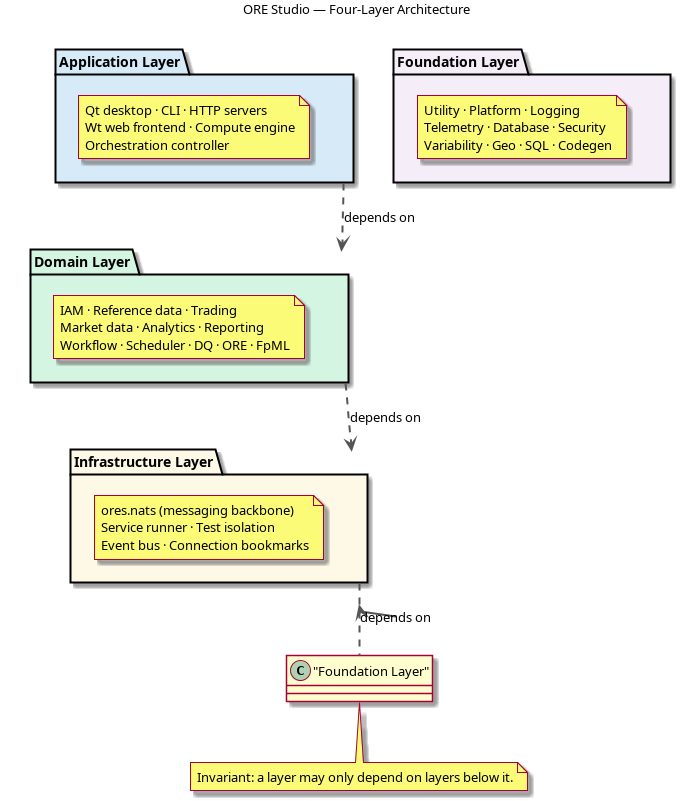

:PROPERTIES:
:ID: D773166D-0C91-8CB4-3323-42166BC07687
:END:
#+title: System Model
#+description: ORE Studio's four-layer architecture (foundation / infrastructure / domain / application) and the components in each layer.
#+type: knowledge
#+level: cross
#+filetags: :modeling:architecture:system_model:index:
#+created: 2024-06-15
#+updated: 2026-05-28
#+startup: inlineimages

This file documents the architecture of the [[id:D04D3476-D7C5-3954-A33B-C641EBCB43F6][ORE Studio]] system —
what /it is/ and what it's /for/ live in [[id:2F71292F-CDB0-4E2E-B50F-4F02E10597C4][Product identity]]. This
page is the index from which each component's
=component_overview.org= hangs, organised into the four
architectural layers below.

In [[id:BA0E3273-DC4B-7CD4-447B-06227B7D09A8][MASD]] terms, the four layers and the components within them are
instances of /physical-space/ meta-layer and meta-component concepts
defined in the [[id:4F24EEB9-58F1-42FD-BF4F-121D890F2D85][logical space]]. For the complementary view — how
MASD's TS→Part→Facet→Archetype hierarchy maps to ORE Studio's code
generation — see [[id:805CBB9F-CD4E-4C79-BD2D-B8AFCF45FB4C][ORE Studio Technical Spaces]].

#+attr_html: :class note
#+begin_quote
To operate on the system architecture, see the =System Architect= skill.
#+end_quote

* System Architecture

ORE Studio is a four-layer system with a single invariant: a layer may
only depend on layers below it. This constraint is not an accident of
history — it is a deliberate architectural boundary that keeps the
system testable in isolation, replaceable one layer at a time, and
understandable without reading the whole codebase. Every component in
the system belongs to exactly one of these layers:

#+attr_html: :alt ORE Studio four-layer architecture
#+caption: ORE Studio four-layer architecture

- [[id:C5F35442-A2C3-415A-80F2-C09CAA0842FF][Foundation Layer]]: the bedrock. No ORE Studio dependency anywhere in this
  layer. Utilities, platform abstractions, logging, database access,
  cryptography, and code generation live here. If it existed before ORE Studio
  had a domain model, it belongs here.
- [[id:6FF02DD3-0F3B-4BCB-87CA-3224030D00E8][Infrastructure Layer]]: communication and testing. Depends only on Foundation.
  [[id:C9C24C99-F16C-45BE-A262-1C0F4502765E][ores.nats]] messaging, the service runner, and the Catch2 integration that
  isolates every test into its own PostgreSQL schema.
- [[id:873CD1C6-7636-4F30-B3D4-3BB7FCBF4DBD][Domain Layer]]: the business. Depends on Foundation + Infrastructure but never
  on Application. Reference data, IAM, trading, market data, reporting, data
  quality — the financial domain model that justifies the system's existence.
- [[id:C9AD7DA5-D00E-4CA9-A978-E74F776E0F17][Application Layer]]: the surfaces. Depends on every layer below. Qt desktop, CLI,
  HTTP servers, Wt web frontend, and the compute engine. If a user touches it,
  it lives here.
- [[id:A3F8B2C1-9D4E-4F7A-B6C5-2E8D1A0F3B9C][Tooling Layer]]: the instruments contributors reach for to build, test, and
  document the system. Not a runtime layer — these components carry no production
  dependency. [[id:6F7A122F-BC0F-4F3E-BA46-8B793FF15D10][ores.compass]], [[id:08FBD248-257A-A474-DD43-DB08949978F1][ores.codegen]], [[id:EAE593F5-B549-4705-A598-344405196574][ores.lisp]], and [[id:B7E9F3A1-C8D2-4E6B-A1F5-9D3C7E8B2A4F][ores.sql]] live here.

* See Also

- For GitHub, Doxygen, Discord, and CDash see [[id:5B271351-399A-4BD7-A096-E5DF1EDAD8F5][Developer Links]].
- See [[id:F27E5DF7-6223-4B6F-80A5-CEFBEB1BC756][Component architecture]] for how CMake targets enforce these layer
  boundaries.
- See [[id:5AAE6900-8488-4E22-9F31-A1B9D5320EFB][CMake setup]] for how the build is organised.
