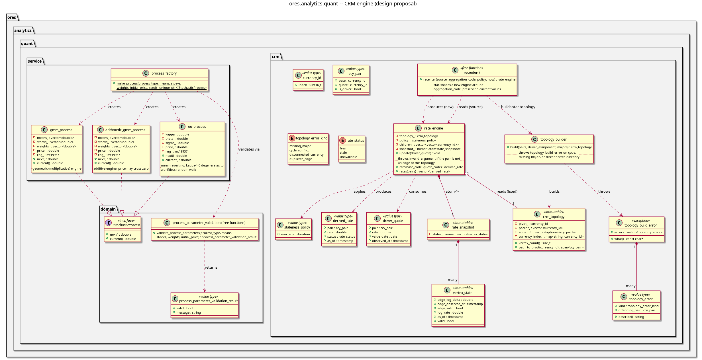

:PROPERTIES:
:ID: D9424733-9602-45DB-8E87-88F2851C3C29
:END:
#+title: ores.analytics.quant
#+description: Dependency-light quantitative math library: CRM spanning-tree topology and thread-safe derived-rate engine.
#+type: ores.codegen.component
#+level: cross
#+filetags: :analytics:quant:crm:component:
#+created: 2026-07-11
#+updated: 2026-07-11
#+name: analytics.quant
#+full_name: ores.analytics.quant
#+brief: Quant math library: CRM topology + rate engine

* Diagram

#+attr_html: :width 100% :alt ores.analytics.quant component diagram
#+caption: ores.analytics.quant

* Summary

Dependency-light quantitative math library. Its first consumer is the
Cross Rates Matrix (CRM): a two-phase engine that builds and validates a
driver/derived spanning-tree topology over currency pairs (throwing a
readable error at build time if the input admits more than one path
between two currencies), then serves continuously-updating derived rates
with staleness propagation. Deliberately has no database, messaging, or
refdata coupling -- everything domain-specific (currency codes, spot days,
short-term rates) is supplied by the caller as plain parameters, so the
library is consumable standalone and fully unit-testable in isolation.

* Inputs

- =domain::ccy_pair_input= -- raw currency-pair quotes (base/quote codes,
  driver flag) fed to =service::topology_builder::build=.
- Pivot currency code and the list of required "major" currencies.
- =domain::driver_quote= -- a single tick on a driver edge, fed to
  =service::rate_engine::update=.
- =domain::staleness_policy= -- caller-supplied max age for a derived rate
  to be considered fresh.

* Outputs

- =domain::crm_topology= -- the immutable, validated spanning tree.
- =domain::topology_build_error= -- thrown with one =topology_error= per
  offending pair when the input cannot form a valid tree.
- =domain::derived_rate= -- a rate (direct or triangulated) with its
  =rate_status= (fresh/stale/unavailable) and the oldest contributing
  driver's timestamp.

* Entry points

- =service::topology_builder::build(pairs, pivot_code, required_majors)=
- =service::rate_engine::update(driver_quote)=
- =service::rate_engine::rate(base_code, quote_code)= /
  =rates(pairs)=

* Dependencies

- =Boost::graph= / =Boost::boost= -- topology construction
  (=boost::disjoint_sets= for incremental cycle detection, BFS for
  parent/path assignment).
- =immer= (=immer::atom<rate_snapshot>=, =immer::vector<vertex_state>=) --
  lock-free, structural-sharing immutable snapshots for the runtime rate
  engine.
- Deliberately *not* linked: =ores.database=, =ores.service=, NATS,
  =ores.refdata=.

* See also

- [[file:../../../doc/agile/versions/v0/sprint_23/crm_implementation/story.org][Story: Cross-rates matrix (CRM)]]
- [[file:../../../doc/agile/versions/v0/sprint_23/crm_implementation/task_model_driver_derived_topology.org][Task: Model the driver/derived spanning-tree topology]]
- [[file:../../../doc/agile/versions/v0/sprint_23/crm_implementation/task_implement_triangulation_derivation.org][Task: Implement triangulation/derivation]]
- [[file:../../../doc/knowledge/domain/crm_graph_topology.org][CRM graph topology and spanning tree]]
- [[file:../../../doc/knowledge/domain/crm_driver_and_derived_rates.org][Driver and derived rates]]
