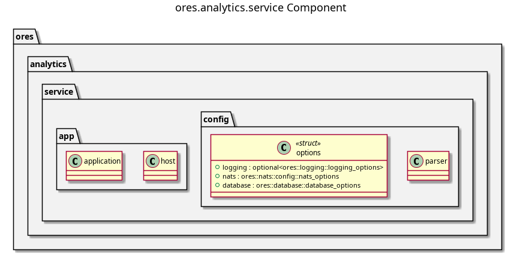

:PROPERTIES:
:ID: E5952F27-53BD-4C4D-85CD-556B6421B768
:END:
#+title: ores.analytics.service
#+description: NATS service entrypoint for the analytics domain.
#+type: component
#+level: cross
#+filetags: :analytics:service:component:
#+created: 2026-05-19
#+updated: 2026-05-19

* Diagram

#+attr_html: :width 100% :alt ores.analytics.service component diagram
#+caption: ores.analytics.service

* Summary

=ores.analytics.service= is the NATS service entrypoint for the analytics
domain. It reads configuration, opens database and NATS connections, registers
all message handlers from =ores.analytics.core=, and runs the event loop.
All business logic lives in =ores.analytics.core=.

* Inputs

- Configuration file: NATS server URL, PostgreSQL connection string.
- NATS request messages for analytics configuration operations.

* Outputs

- A running NATS service for analytics operations.
- NATS response messages returned to callers.
- Structured logs via =ores.logging=.

* Entry points

- =src/main.cpp= — process entry point.
- =src/app/= — application bootstrap.
- =src/config/= — configuration parsing.

* Dependencies

- =ores.analytics.core= — all NATS handlers, repositories, and services.
- =ores.analytics.api= — shared protocol types.
- =ores.logging= — structured logging.
- =nats.c= — NATS client.

* See also

- [[id:BC804C31-D6F7-4E4E-9C4F-F4578BEAF4F5][ores.analytics.core]] — all business logic for the analytics domain.
