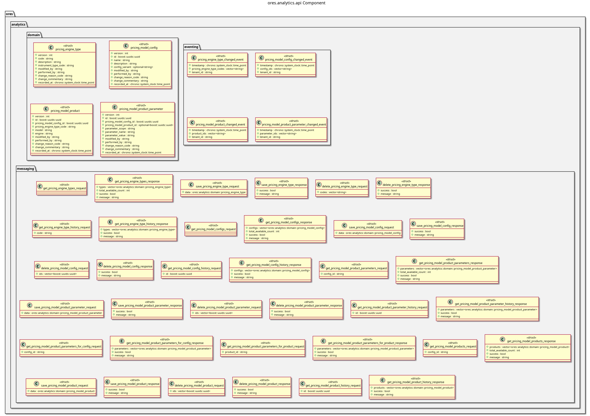

:PROPERTIES:
:ID: 66D3F1D6-1926-40CF-BCF5-AA42F14AD6D5
:END:
#+title: ores.analytics.api
#+description: Domain types and NATS protocol schemas for the analytics component.
#+type: ores.codegen.component
#+level: cross
#+filetags: :analytics:api:component:
#+created: 2026-05-19
#+updated: 2026-05-19
#+name: analytics.api
#+full_name: ores.analytics.api
#+brief: Public API types for ORE Studio analytics.

* Diagram

#+attr_html: :width 100% :alt ores.analytics.api component diagram
#+caption: ores.analytics.api

* Summary

=ores.analytics.api= is a header-only library defining the shared contract for
the analytics domain. It provides domain types for pricing-engine types,
pricing-model configurations, and product-parameter mappings, with JSON and
table I/O via =rfl=, and the NATS protocol schemas consumed by
=ores.analytics.core= and Qt clients.

* Inputs

- Domain entity type definitions across =domain/= headers.

* Outputs

- C++ headers for all analytics domain types with JSON and table I/O.
- NATS protocol headers for pricing-model management operations.

* Entry points

- =include/ores.analytics.api/domain/= — all domain entity headers.
- =include/ores.analytics.api/messaging/= — NATS protocol message headers.

* Dependencies

- =rfl= — JSON serialisation via reflection.
- =fort= — formatted table rendering.

* See also

- [[id:D4E6E417-7D34-44B1-A373-73A1C9183137][ores.analytics]] — component group overview.

- [[id:BC804C31-D6F7-4E4E-9C4F-F4578BEAF4F5][ores.analytics.core]] — business logic, persistence, and NATS handlers.
