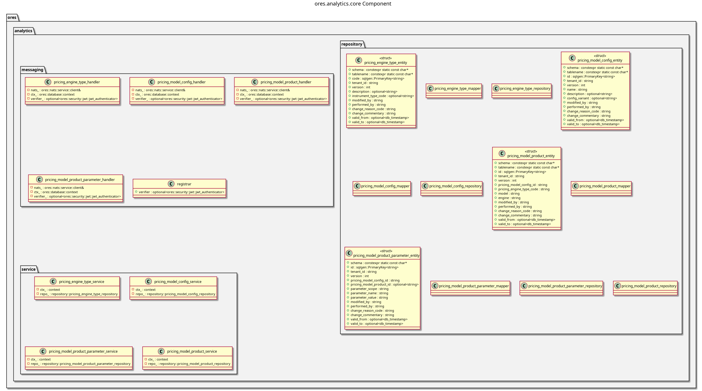

:PROPERTIES:
:ID: BC804C31-D6F7-4E4E-9C4F-F4578BEAF4F5
:END:
#+title: ores.analytics.core
#+description: Pricing model and analytics configuration — model types, product parameters, and batch pricing.
#+type: ores.codegen.component
#+level: cross
#+filetags: :analytics:core:component:
#+created: 2026-05-19
#+updated: 2026-05-19
#+name: analytics.core
#+full_name: ores.analytics.core
#+brief: Core implementation for ORE Studio analytics.

* Diagram

#+attr_html: :width 100% :alt ores.analytics.core component diagram
#+caption: ores.analytics.core

* Summary

=ores.analytics.core= manages pricing model configuration for ORE Studio. It
maintains pricing-engine types, pricing-model configurations, the mapping of
models to product types (=pricing_model_product=), and per-product parameter
sets (=pricing_model_product_parameter=). These configurations drive the ORE
risk-engine runs executed by =ores.reporting.core=. A NATS handler layer
exposes all CRUD operations to clients.

* Inputs

- NATS request messages for pricing-model configuration management.
- PostgreSQL connections to =ores_analytics_*= tables.

* Outputs

- Pricing-model configuration records persisted to the =ores_analytics= schema.
- NATS response messages returned to callers.

* Entry points

- =include/ores.analytics.core/ores.analytics.core.hpp= — aggregate include.
- =include/ores.analytics.core/messaging/registrar.hpp= — registers all NATS
  handlers.
- =include/ores.analytics.core/service/= — per-entity service headers.

* Dependencies

- =ores.analytics.api= — shared domain types and NATS protocol schemas.
- =ores.dq= — ORM base classes and persistence infrastructure.
- =ores.iam.core= — identity and authorisation context.
- =rfl= — JSON serialisation via reflection.
- =soci= — SQL ORM for PostgreSQL persistence.
- =nats.c= — NATS messaging client.

* See also

- [[id:D4E6E417-7D34-44B1-A373-73A1C9183137][ores.analytics]] — component group overview.

- [[id:66D3F1D6-1926-40CF-BCF5-AA42F14AD6D5][ores.analytics.api]] — protocol types and domain entities.
- [[id:E5952F27-53BD-4C4D-85CD-556B6421B768][ores.analytics.service]] — NATS service entrypoint.
