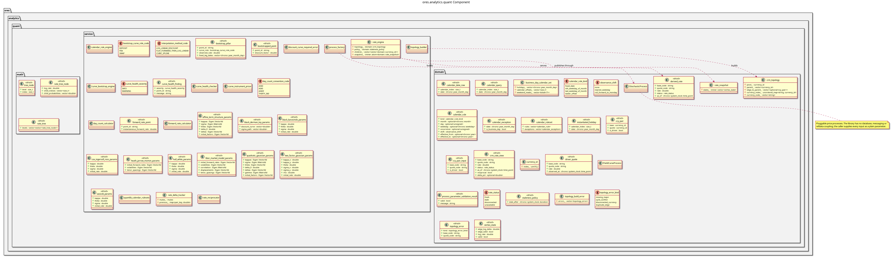

:PROPERTIES:
:ID: D9424733-9602-45DB-8E87-88F2851C3C29
:END:
#+title: ores.analytics.quant
#+description: Dependency-light quantitative math library: CRM spanning-tree topology, thread-safe derived-rate engine, and stochastic price processes.
#+type: ores.codegen.component
#+level: cross
#+filetags: :analytics:quant:crm:synthetic:component:
#+created: 2026-07-11
#+updated: 2026-07-12
#+name: analytics.quant
#+full_name: ores.analytics.quant
#+brief: Quant math library: CRM topology, rate engine, stochastic processes

* Diagram

#+attr_html: :width 100% :alt ores.analytics.quant component diagram
#+caption: ores.analytics.quant

* Summary

Dependency-light quantitative math library. One consumer is the Cross
Rates Matrix (CRM): a two-phase engine that builds and validates a
driver/derived spanning-tree topology over currency pairs (throwing a
readable error at build time if the input admits more than one path
between two currencies), then serves continuously-updating derived rates
with staleness propagation. Deliberately has no database, messaging, or
refdata coupling -- everything domain-specific (currency codes, spot days,
short-term rates) is supplied by the caller as plain parameters, so the
library is consumable standalone and fully unit-testable in isolation.

A second, unrelated area covers stochastic price processes: pluggable
=IStochasticProcess= implementations (geometric and arithmetic Gaussian
mixture engines, an Ornstein-Uhlenbeck mean-reverting engine), a
=process_factory= that builds one from a process-type string plus raw
parameters, and =process_parameter_validation= as the single source of
truth for "are these parameters good?" shared between server-side
construction and any UI that wants a friendly error before submitting.
This code originated in ores.synthetic, which mixed the maths with
synthetic-data-generation orchestration; it moved here so the maths is
reusable (e.g. by a future calibration service) and independently
unit-testable without pulling in a service binary.

* Inputs

- =domain::ccy_pair_input= -- raw currency-pair quotes (base/quote codes,
  driver flag) fed to =service::topology_builder::build=.
- Pivot currency code and the list of required "major" currencies.
- =domain::driver_quote= -- a single tick on a driver edge, fed to
  =service::rate_engine::update=.
- =domain::staleness_policy= -- caller-supplied max age for a derived rate
  to be considered fresh.
- Raw process parameters (means, stdevs, weights, initial_price) plus a
  =process_type= string ("geometric" / "arithmetic" / "ornstein_uhlenbeck"), fed to
  =service::process_factory::make_process= and
  =domain::validate_process_parameters=.

* Outputs

- =domain::crm_topology= -- the immutable, validated spanning tree.
- =domain::topology_build_error= -- thrown with one =topology_error= per
  offending pair when the input cannot form a valid tree.
- =domain::derived_rate= -- a rate (direct or triangulated) with its
  =rate_status= (fresh/stale/unavailable) and the oldest contributing
  driver's timestamp.
- =domain::IStochasticProcess= -- the pure interface every price process
  implements (=next()= advances one step, =current()= reads without
  advancing).
- =domain::process_parameter_validation_result= -- ok/error-message pair
  from validating raw process parameters before construction.

* Entry points

- =service::topology_builder::build(pairs, pivot_code, required_majors)=
- =service::rate_engine::update(driver_quote)=
- =service::rate_engine::rate(base_code, quote_code)= /
  =rates(pairs)=
- =service::recenter(source_engine, aggregation_code, policy, now)= --
  point-in-time star-shaping around an aggregation currency for risk,
  preserving every current rate's value.
- =service::process_factory::make_process(process_type, means, stdevs,
  weights, initial_price, seed)= -- builds a =gaussian_mixture_model_process=
  (geometric/multiplicative), =arithmetic_gaussian_mixture_model_process=
  (additive/Bachelier), or =ornstein_uhlenbeck_process= (mean-reverting) depending on
  =process_type=; unrecognised values fall back to geometric.
- =domain::validate_process_parameters(process_type, means, stdevs,
  weights, initial_price)=

* Dependencies

- =Boost::graph= / =Boost::boost= -- topology construction
  (=boost::disjoint_sets= for incremental cycle detection, BFS for
  parent/path assignment).
- =immer= (=immer::atom<rate_snapshot>=, =immer::vector<vertex_state>=) --
  lock-free, structural-sharing immutable snapshots for the runtime rate
  engine.
- Deliberately *not* linked: =ores.database=, =ores.service=, NATS,
  =ores.refdata=, =ores.logging= (the stochastic-process code carries no
  logging dependency either -- callers that need diagnostics log around
  the call).

* See also

- [[id:D4E6E417-7D34-44B1-A373-73A1C9183137][ores.analytics]] — component group overview.
- [[id:66D3F1D6-1926-40CF-BCF5-AA42F14AD6D5][ores.analytics.api]] — protocol types and domain entities.
- [[id:BC804C31-D6F7-4E4E-9C4F-F4578BEAF4F5][ores.analytics.core]] — business logic, persistence, and NATS handlers.
- [[id:E5952F27-53BD-4C4D-85CD-556B6421B768][ores.analytics.service]] — NATS service entrypoint.
- [[id:1907531F-E2AF-4BF7-84A4-6D69CB9EDFD7][CRM graph topology and spanning tree]]
- [[id:A1BA9EE6-313E-4802-8F63-FEE6BFB63A69][Driver and derived rates]]
- [[id:DC08D216-348D-4511-A42D-4016EBBF38F7][CRM risk: recentering and artefacts]]
- [[id:CEB88862-4602-4D02-871F-EB8099DCE1B3][Story: Extract stochastic process math from ores.synthetic into ores.analytics.quant]]
- [[id:B38B3869-02FD-4CC7-99BD-9A77904ACA19][Story: Cross-rates matrix (CRM)]]
- [[id:E7E31384-3616-4DFB-AB20-6CB099114FB3][Task: Model the driver/derived spanning-tree topology]]
- [[id:96522E06-2067-4058-86FC-27B6086DCC26][Task: Implement triangulation/derivation]]
- [[id:6EA4B5FC-4581-484C-B5EB-ECF868B3A61D][Task: Implement risk recentering]]
