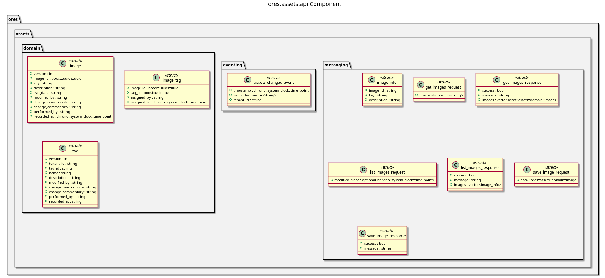

:PROPERTIES:
:ID: 34DDEE6A-915F-404B-8721-01376903D3E4
:END:
#+title: ores.assets.api
#+name: assets.api
#+full_name: ores.assets.api
#+description: Domain types, JSON I/O, and NATS protocol schemas for the assets component.
#+type: ores.codegen.component
#+level: cross
#+filetags: :assets:api:component:
#+created: 2026-05-19
#+updated: 2026-05-19

* Diagram

#+attr_html: :width 100% :alt ores.assets.api component diagram
#+caption: ores.assets.api

* Summary

=ores.assets.api= is a header-only library defining the shared contract for
the assets domain. It provides domain types for images (SVG text), tags, and
their associations, JSON serialisation via =rfl=, and the NATS message protocol
schemas consumed by both =ores.assets.core= (server) and Qt client components.

* Inputs

- Domain entity definitions in =domain/= headers.
- NATS protocol message definitions in =messaging/assets_protocol.hpp=.

* Outputs

- C++ headers: =image.hpp=, =tag.hpp=, =image_tag.hpp=, with JSON I/O
  variants (=*_json_io.hpp=).
- NATS protocol header: =messaging/assets_protocol.hpp=.
- Aggregate header: =ores.assets.api.domain.hpp=.

* Entry points

- =include/ores.assets.api/domain/= — all domain entity headers.
- =include/ores.assets.api/messaging/assets_protocol.hpp= — NATS protocol
  message types.

* Dependencies

- =rfl= — JSON serialisation via reflection.

* See also

- [[id:DF32FBB0-84E3-4679-A4ED-1E2A9FD9CADF][ores.assets.core]] — business logic, persistence, and NATS handlers.
- [[id:F5E6A7B8-C9D0-1234-EFAB-345678901234][ores.assets Messaging Reference]] — full NATS subject and message catalogue.
