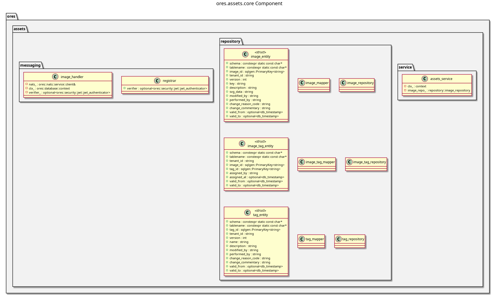

:PROPERTIES:
:ID: DF32FBB0-84E3-4679-A4ED-1E2A9FD9CADF
:END:
#+title: ores.assets.core
#+name: assets.core
#+full_name: ores.assets.core
#+description: Asset management — SVG images, tags, currency-image associations, and NATS message handlers.
#+type: ores.codegen.component
#+level: cross
#+filetags: :assets:core:component:
#+created: 2026-05-19
#+updated: 2026-05-19

* Diagram

#+attr_html: :width 100% :alt ores.assets.core component diagram
#+caption: ores.assets.core

* Summary

=ores.assets.core= manages dynamically loaded images (SVG), tags, image-tag
associations, and currency-to-image mappings in ORE Studio. It provides the
business logic and persistence layer — domain services, temporal ORM
repositories, and NATS message handlers in the 0x4000–0x4FFF range — that
let clients store, categorise, and retrieve asset images at runtime. It also
ships a synthetic-data generator for test and development use.

* Inputs

- NATS request messages from Qt clients (image create/update/query, tag
  operations, currency-image lookups) in the 0x4000–0x4FFF range.
- PostgreSQL connections to =ores_assets_*= tables (=images=, =tags=,
  =image_tags=, =currency_images=) with temporal versioning.
- DQ population events via =publish_from_dq_handler= when assets are loaded
  from the data-quality pipeline.

* Outputs

- Image, tag, and association records persisted to the =ores_assets= schema
  with bitemporal history (=valid_from= / =valid_to=).
- NATS response messages returned to callers.

* Entry points

- =include/ores.assets.core/ores.assets.hpp= — aggregate include.
- =include/ores.assets.core/messaging/registrar.hpp= — registers all NATS
  handlers with the service host.
- =include/ores.assets.core/service/assets_service.hpp= — top-level business
  logic entry point.

* Dependencies

- =ores.assets.api= — shared domain types and NATS protocol schemas.
- =ores.dq= — ORM base classes and data-quality infrastructure.
- =ores.iam.core= — identity and authorisation context.
- =rfl= — JSON serialisation via reflection.
- =soci= — SQL ORM for PostgreSQL persistence.
- =nats.c= — NATS messaging client.

* See also

- [[id:34DDEE6A-915F-404B-8721-01376903D3E4][ores.assets.api]] — protocol types and domain entities.
- [[id:6D1AA78F-F37B-4030-B32C-B8B5EB4B0EEE][ores.assets.service]] — NATS service entrypoint.
- [[id:F5E6A7B8-C9D0-1234-EFAB-345678901234][ores.assets Messaging Reference]] — full NATS subject and message catalogue.
