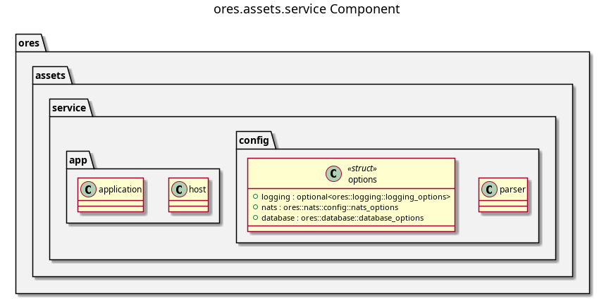

:PROPERTIES:
:ID: 6D1AA78F-F37B-4030-B32C-B8B5EB4B0EEE
:END:
#+title: ores.assets.service
#+description: NATS service entrypoint for the assets domain — wires handlers, repositories, and configuration.
#+type: ores.codegen.component
#+level: cross
#+filetags: :assets:service:component:
#+created: 2026-05-19
#+updated: 2026-05-19
#+name: assets.service
#+full_name: ores.assets.service
#+brief: Asset management service

* Diagram

#+attr_html: :width 100% :alt ores.assets.service component diagram
#+caption: ores.assets.service

* Summary

=ores.assets.service= is the NATS service entrypoint for the assets domain.
It reads configuration, opens database and NATS connections, registers all
message handlers from =ores.assets.core=, and runs the event loop. All
business logic lives in =ores.assets.core=; this component is responsible
only for bootstrap, dependency injection, and graceful shutdown.

* Inputs

- Configuration file: NATS server URL, PostgreSQL connection string, and
  environment settings.
- NATS request messages from Qt clients on the =ores.assets.*= subject
  hierarchy (0x4000–0x4FFF range).

* Outputs

- A running NATS service handling all assets operations.
- NATS response messages returned to callers.
- Structured logs via =ores.logging=.

* Entry points

- =src/main.cpp= — process entry point.
- =src/app/= — application bootstrap and dependency injection.
- =src/config/= — configuration parsing and validation.

* Dependencies

- =ores.assets.core= — all NATS handlers, repositories, and domain services.
- =ores.assets.api= — shared protocol types.
- =ores.logging= — structured logging infrastructure.
- =nats.c= — NATS client for connection management.

* See also

- [[id:DF32FBB0-84E3-4679-A4ED-1E2A9FD9CADF][ores.assets.core]] — all business logic for the assets domain.
