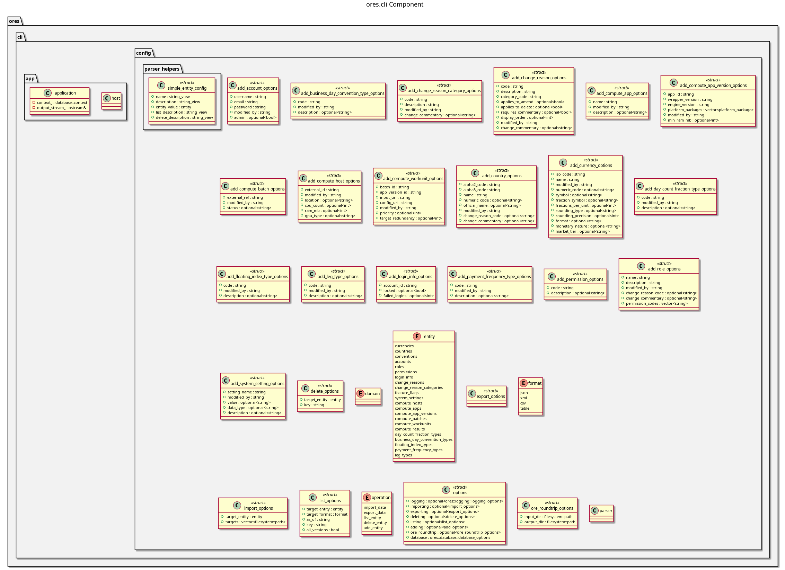

:PROPERTIES:
:ID: F0DAACD0-8EAB-46C4-6B53-640921E3F225
:END:
#+title: ores.cli
#+name: cli
#+full_name: ores.cli
#+description: Command-line tool for importing and exporting ORE Studio reference data (currencies, countries) from JSON, XML, and CSV.
#+type: ores.codegen.component
#+level: cross
#+filetags: :cli:tool:component:
#+created: 2026-05-20
#+updated: 2026-05-20

* Diagram

#+attr_html: :width 100% :alt ores.cli component diagram
#+caption: ores.cli

* Summary

=ores.cli= is a command-line tool for importing and exporting ORE Studio
reference data directly against the database. It supports currencies in JSON,
XML, and CSV formats, with options for temporal queries (as-of a timepoint or
all versions) and key-based filtering. The tool uses Boost.program_options for
argument parsing and accesses repositories directly, bypassing the NATS service
layer. It is intended for administrative and data-migration tasks.

* Inputs

- CLI arguments: operation (import/export), format (JSON/XML/CSV), file path,
  optional entity key, optional as-of timestamp.
- Input files: JSON, XML, or CSV data files containing reference-data records.
- Database connection via configuration.

* Outputs

- Imported records written to the PostgreSQL database.
- Exported files in the requested format (JSON, XML, or CSV).

* Entry points

- =src/main.cpp= — process entry point.
- =src/config/= — Boost.program_options argument parsing.
- =src/app/= — application hosting and execution logic.

* Dependencies

- =ores.database= — repository access for direct DB operations.
- =ores.refdata.api= or =ores.trading.api= — domain types for entities being
  imported/exported.
- Boost.ProgramOptions, =rfl= — argument parsing and JSON/XML serialisation.

* See also

-
