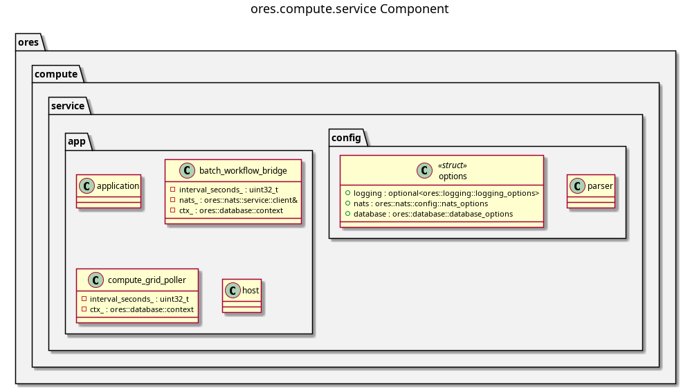

:PROPERTIES:
:END:
#+title: ORE Studio Compute Service Component
#+author: Marco Craveiro
#+options: <:nil c:nil todo:nil ^:nil d:nil date:nil author:nil toc:nil html-postamble:nil
#+startup: inlineimages

* Component Architecture

#+attr_html: :width 100% :alt ORE Studio Compute Service Component Diagram
#+caption: ORE Studio Compute Service Component Diagram

