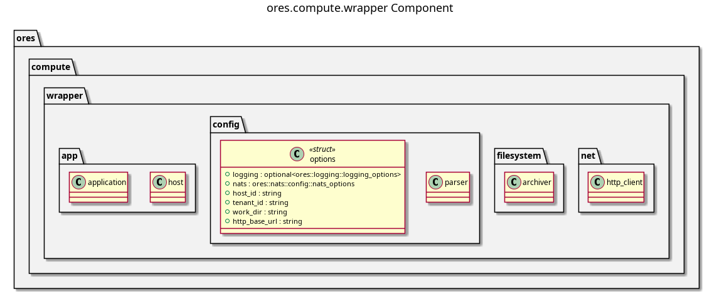

:PROPERTIES:
:ID: F1B19D84-A5C9-4478-BB46-EE6EA62DAFCA
:END:
#+title: ores.compute.wrapper
#+description: Compute worker wrapper — executes ORE risk runs and reports results to ores.compute.core.
#+type: component
#+version: 2
#+level: cross
#+filetags: :compute:wrapper:component:
#+created: 2026-05-19
#+updated: 2026-05-19

* Diagram

#+attr_html: :width 100% :alt ores.compute.wrapper component diagram
#+caption: ores.compute.wrapper

* Summary

=ores.compute.wrapper= is the worker-node process for ORE risk runs. It
registers itself with =ores.compute.core=, waits for job assignments via NATS,
executes an ORE risk run for each assigned batch, and reports the result back
to the orchestrator. Multiple wrapper instances can run on different machines to
scale risk computation horizontally.

* Inputs

- NATS job-assignment message from =ores.compute.core= containing the ORE input
  file set and run parameters.
- Configuration: NATS URL, ORE executable path, working directory.

* Outputs

- ORE risk-run output files (NPV cube, cashflows, etc.) written to a shared
  output location.
- NATS job-completion message (result path, status) sent back to
  =ores.compute.core=.

* Entry points

- =src/main.cpp= — process entry point; registers with orchestrator and starts
  the job-receive loop.
- =src/app/= — bootstrap and job execution logic.
- =src/config/= — configuration parsing.

* Dependencies

- =ores.compute.api= — shared protocol types (job assignment, result messages).
- =ores.logging= — structured logging.
- =nats.c= — NATS client.

* See also

- [[id:3BFFDF5C-86F5-4D57-9D9F-676D0D62B344][ores.compute.core]] — orchestrator that dispatches jobs to this worker.
