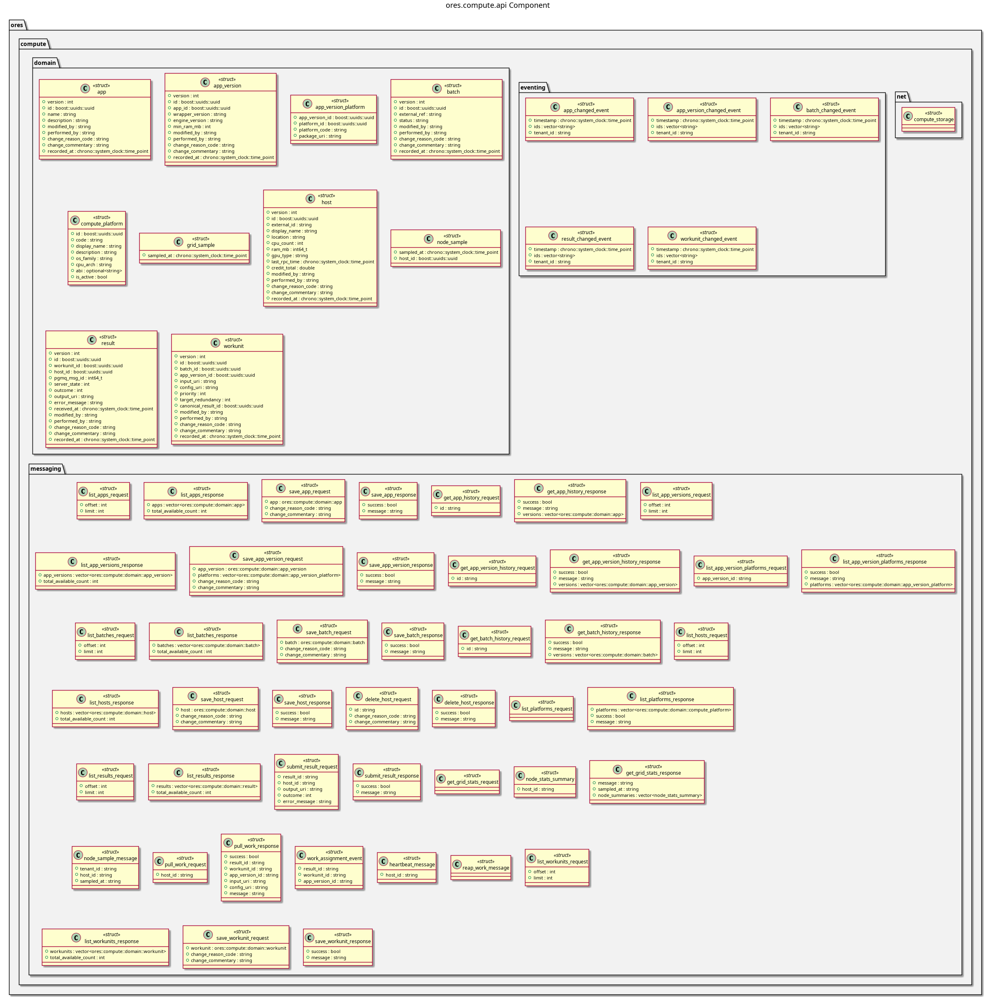

:PROPERTIES:
:ID: A59E121A-B8FB-43F0-A5CD-1FA5F426E66A
:END:
#+title: ores.compute.api
#+name: compute.api
#+full_name: ores.compute.api
#+description: Domain types and NATS protocol schemas for the compute component.
#+type: ores.codegen.component
#+level: cross
#+filetags: :compute:api:component:
#+created: 2026-05-19
#+updated: 2026-05-19

* Diagram

#+attr_html: :width 100% :alt ores.compute.api component diagram
#+caption: ores.compute.api

* Summary

=ores.compute.api= is a header-only library defining the shared contract for
the compute domain. It provides domain types for apps, app versions, compute
hosts, batches, and results, with JSON I/O via =rfl=, and the NATS protocol
schemas used by both the orchestrator (=ores.compute.core=) and worker nodes
(=ores.compute.wrapper=).

* Inputs

- Domain entity type definitions across =domain/= headers.

* Outputs

- C++ headers for compute domain types with JSON I/O.
- NATS protocol headers for batch dispatch, registration, and result reporting.

* Entry points

- =include/ores.compute.api/domain/=, =include/ores.compute.api/messaging/=.

* Dependencies

- =rfl= — JSON serialisation via reflection.

* See also

- [[id:A8B7F2C9-D416-4E83-B527-9F814E62C1A5][ores.compute]] — component group overview.

- [[id:3BFFDF5C-86F5-4D57-9D9F-676D0D62B344][ores.compute.core]] — orchestrator side.
- [[id:F1B19D84-A5C9-4478-BB46-EE6EA62DAFCA][ores.compute.wrapper]] — worker side.
