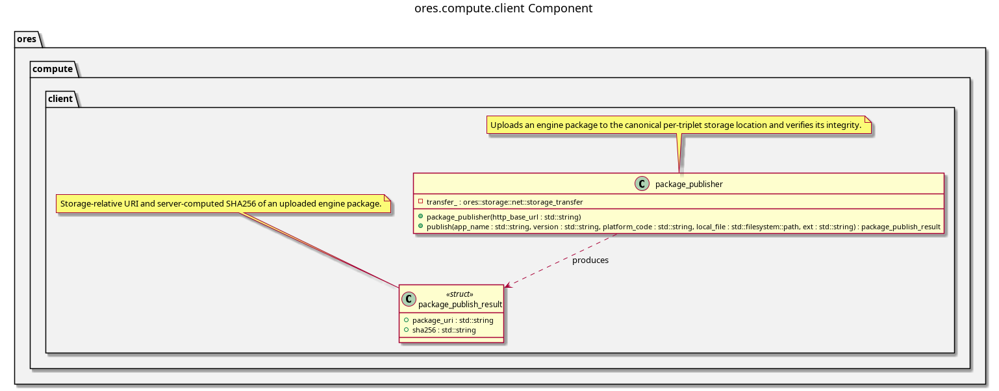

:PROPERTIES:
:ID: 65b074fd-b20b-4fec-ba1c-a04367fb9150
:END:
#+title: ores.compute.client
#+description: Consumer-side compute helper: engine package upload with client-vs-server hash verification.
#+type: ores.codegen.component
#+level: cross
#+filetags: :compute:client:component:
#+created: 2026-09-06
#+updated: 2026-09-06
#+name: compute.client
#+full_name: ores.compute.client
#+brief: Compute engine package publisher

* Diagram

#+attr_html: :width 100% :alt ores.compute.client component diagram
#+caption: ores.compute.client

* Summary

=ores.compute.client= is the shared consumer-side library for publishing
compute engine packages. Its single class, =package_publisher=, uploads a
local package archive to the canonical per-triplet storage location and
verifies its integrity: it computes the local SHA256 before uploading,
compares it against the server's own SHA256 of the bytes received, and
throws on mismatch rather than returning a result the caller might trust.

It is the one shared core behind both =ores.shell='s non-interactive publish
command and =ores.qt='s "Upload Engines" dialog. Building and sending the
=save_app_request= and =save_app_version_request= NATS messages that register
the uploaded package stays with each caller, since shell and Qt each already
have their own request/response plumbing.

* Inputs

- The app name, version, and platform triplet to publish under.
- The local path of the package archive to upload.
- The HTTP base URL of the storage server.

* Outputs

- =package_publish_result=: the storage-relative package URI and the
  server-computed SHA256, ready for
  =ores_compute_app_version_platforms_tbl.package_uri= and =.sha256=.

* Entry points

- =client/package_publisher.hpp= — =package_publisher::publish()= and the
  =package_publish_result= struct.

* Dependencies

- =ores.storage= — the =storage_transfer= HTTP upload client.
- =ores.compute.api= — the domain types the result rows feed into (via the
  callers' own NATS registrations).

* See also

- [[id:A8B7F2C9-D416-4E83-B527-9F814E62C1A5][ores.compute]] — component group overview.
- [[id:3BFFDF5C-86F5-4D57-9D9F-676D0D62B344][ores.compute.core]] — registers the uploaded packages as app versions.
- [[id:F1B19D84-A5C9-4478-BB46-EE6EA62DAFCA][ores.compute.wrapper]] — the worker that runs the packages this part publishes.
