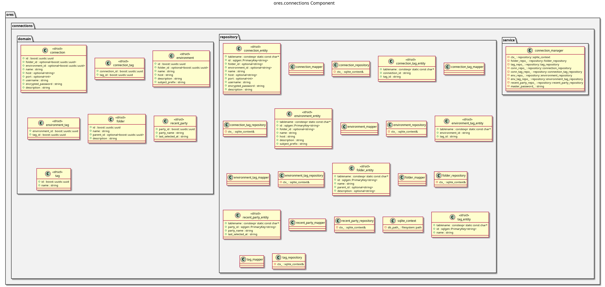

:PROPERTIES:
:ID: E75DE282-4FDE-4B18-B23B-692A2F783B61
:END:
#+title: ores.connections
#+name: connections
#+full_name: ores.connections
#+description: Client-side server connection bookmark manager with AES-256-GCM credential encryption and SQLite persistence.
#+type: ores.codegen.component
#+level: cross
#+filetags: :connections:client:component:
#+created: 2026-05-20
#+updated: 2026-05-20

* Diagram

#+attr_html: :width 100% :alt ores.connections component diagram
#+caption: ores.connections

* Summary

=ores.connections= manages client-side server connection bookmarks with
encrypted credential storage. Connections are organised into hierarchical
folders and cross-cutting tags, with passwords encrypted using AES-256-GCM
and a master password derived via PBKDF2. State is persisted in a local SQLite
database. The component is used by =ores.qt= and =ores.shell= to store and
retrieve server credentials.

* Inputs

- Master password for AES-256-GCM key derivation and credential decryption.
- Connection bookmark details: server address, port, username, encrypted
  password, folder, and tags.

* Outputs

- Persisted connection bookmarks in a local SQLite database.
- Decrypted credentials for connection establishment.

* Entry points

- =include/ores.connections/service/= — =connection_manager= service API.
- =include/ores.connections/domain/= — folder, tag, and server_environment types.
- =include/ores.connections/repository/= — ORM entities, mappers, repositories.

* Dependencies

- =ores.security= — AES-256-GCM encryption and PBKDF2 key derivation.
- SQLite — local bookmark persistence.

* See also

-
