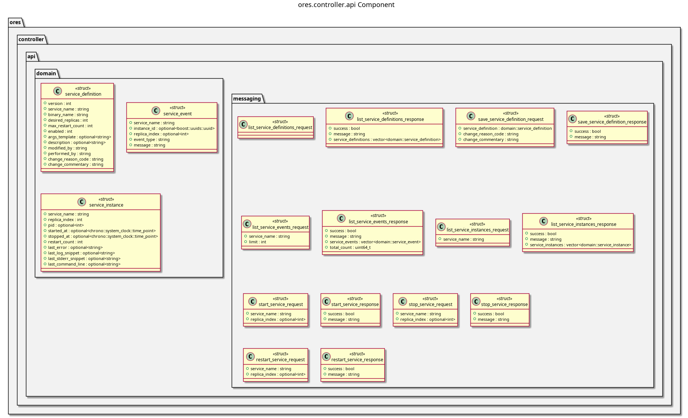

:PROPERTIES:
:ID: 85D20E29-0EBD-41FF-9F32-10F60AF074A8
:END:
#+title: ores.controller.api
#+description: Domain types and NATS protocol schemas for the controller component.
#+type: ores.codegen.component
#+level: cross
#+filetags: :controller:api:component:
#+created: 2026-05-19
#+updated: 2026-05-19
#+name: controller.api
#+full_name: ores.controller.api
#+brief: NATS protocol types for the ORE Studio service controller.

* Diagram

#+attr_html: :width 100% :alt ores.controller.api component diagram
#+caption: ores.controller.api

* Summary

=ores.controller.api= is a header-only library defining the shared contract for
the controller domain. It provides domain types for service definitions,
instances, and lifecycle events, with JSON I/O via =rfl=, and the NATS protocol
schemas consumed by =ores.controller.core= and all services that register
themselves at startup.

* Inputs

- Domain entity type definitions.

* Outputs

- C++ headers for controller domain types.
- NATS protocol headers for service registration and event reporting.

* Entry points

- =include/ores.controller.api/domain/=, =include/ores.controller.api/messaging/=.

* Dependencies

- =rfl= — JSON serialisation via reflection.

* See also

- [[id:D2C5E91A-7864-4F32-A1B9-6E50D2B47A88][ores.controller]] — component group overview.

- [[id:C871C5DF-A521-4815-9572-72D07DA62CC7][ores.controller.core]] — registry logic and NATS handlers.
