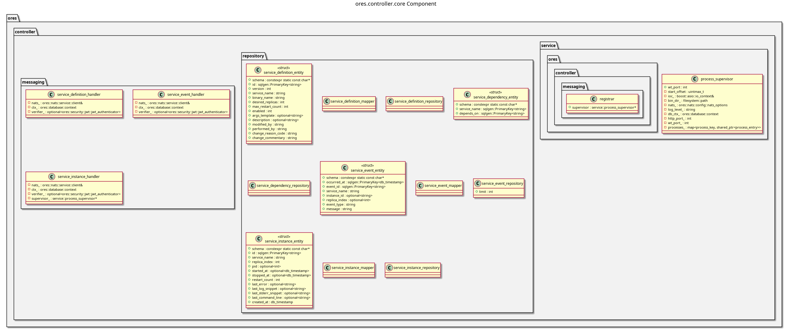

:PROPERTIES:
:ID: C871C5DF-A521-4815-9572-72D07DA62CC7
:END:
#+title: ores.controller.core
#+description: Service registry and lifecycle controller — tracks running services, instances, and health events.
#+type: ores.codegen.component
#+level: cross
#+filetags: :controller:core:component:
#+created: 2026-05-19
#+updated: 2026-05-19
#+name: controller.core
#+full_name: ores.controller.core
#+brief: Core lifecycle management logic for the ORE Studio service controller.

* Diagram

#+attr_html: :width 100% :alt ores.controller.core component diagram
#+caption: ores.controller.core

* Summary

=ores.controller.core= is the service registry and lifecycle controller for
ORE Studio. It maintains a catalogue of service definitions (=service_definition=),
running instances (=service_instance=), and lifecycle events (=service_event=),
letting the platform monitor which services are up, track failures, and drive
orchestrated startup/shutdown sequences. NATS handlers expose the registry to
Qt clients and other services.

* Inputs

- NATS registration and heartbeat messages from all running services.
- NATS management requests from Qt clients (service listing, event history).
- PostgreSQL connections to =ores_controller_*= tables.

* Outputs

- Service-registry records persisted to the =ores_controller= schema.
- NATS response messages returned to callers.

* Entry points

- =include/ores.controller.core/ores.controller.core.hpp= — aggregate include.
- =include/ores.controller.core/messaging/registrar.hpp= — registers handlers.
- =include/ores.controller.core/messaging/= — per-entity NATS handlers.

* Dependencies

- =ores.controller.api= — shared domain types and NATS protocol schemas.
- =ores.dq=, =ores.iam.core=, =rfl=, =soci=, =nats.c=.

* See also

- [[id:D2C5E91A-7864-4F32-A1B9-6E50D2B47A88][ores.controller]] — component group overview.

- [[id:85D20E29-0EBD-41FF-9F32-10F60AF074A8][ores.controller.api]] — protocol types and domain entities.
- [[id:1A4E357C-0B10-44CF-9096-47EE42E6F1A4][ores.controller.service]] — NATS service entrypoint.
