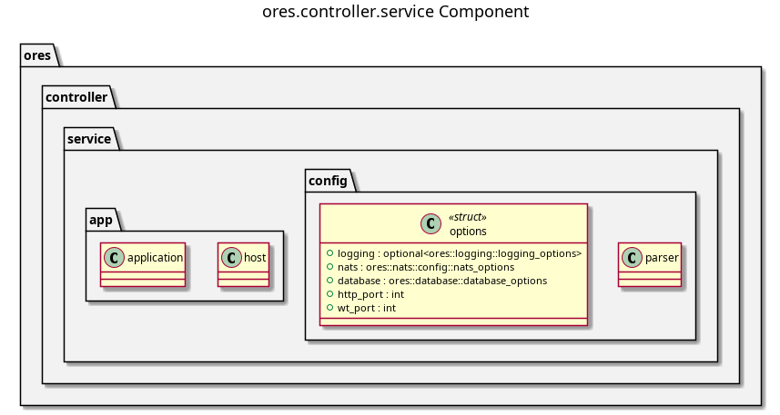

:PROPERTIES:
:ID: 1A4E357C-0B10-44CF-9096-47EE42E6F1A4
:END:
#+title: ores.controller.service
#+description: NATS service entrypoint for the controller domain.
#+type: ores.codegen.component
#+level: cross
#+filetags: :controller:service:component:
#+created: 2026-05-19
#+updated: 2026-05-19
#+name: controller.service
#+full_name: ores.controller.service
#+brief: ORE Studio service controller binary.

* Diagram

#+attr_html: :width 100% :alt ores.controller.service component diagram
#+caption: ores.controller.service

* Summary

=ores.controller.service= is the NATS service entrypoint for the controller
domain. It opens database and NATS connections, registers handlers from
=ores.controller.core=, and runs the event loop.

* Inputs

- Configuration file: NATS server URL, PostgreSQL connection string.

* Outputs

- A running NATS service for service-registry operations.

* Entry points

- =src/main.cpp=, =src/app/=, =src/config/=.

* Dependencies

- =ores.controller.core=, =ores.controller.api=, =ores.logging=, =nats.c=.

* See also

- [[id:D2C5E91A-7864-4F32-A1B9-6E50D2B47A88][ores.controller]] — component group overview.

- [[id:C871C5DF-A521-4815-9572-72D07DA62CC7][ores.controller.core]] — all registry logic.
