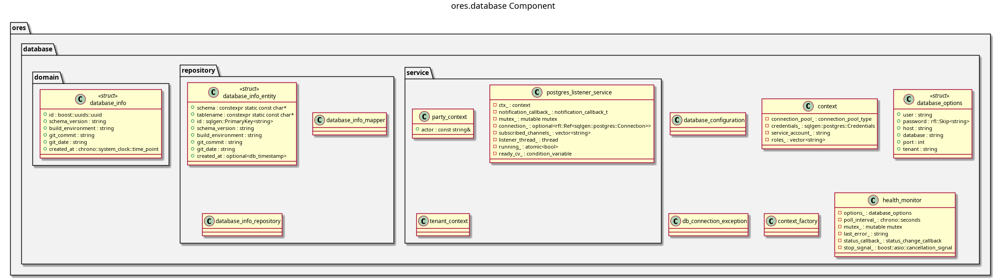

:PROPERTIES:
:ID: 3A8F2E91-D4C7-8AB4-5E23-91D6F8C04A72
:END:
#+title: ores.database
#+name: database
#+full_name: ores.database
#+description: PostgreSQL database access layer — connection pool, tenant context, bitemporal operations, and repository helpers.
#+type: ores.codegen.component
#+level: cross
#+filetags: :database:persistence:component:
#+created: 2026-05-20
#+updated: 2026-05-20

* Diagram

#+attr_html: :width 100% :alt ores.database component diagram
#+caption: ores.database

* Summary

=ores.database= is the shared PostgreSQL access layer used by every domain
service. It provides a connection pool (=tenant_aware_pool=), tenant and party
context management, bitemporal CRUD operations, repository base helpers, and
database-info entities for schema introspection. It also exposes a
=health_monitor= and a =postgres_listener_service= for LISTEN/NOTIFY
integration. All persistence code in domain services builds on this library.

* Inputs

- PostgreSQL connection string from service configuration.
- Tenant and party identifiers set per request for row-level security.

* Outputs

- Pooled libpqxx connections scoped to tenant/party context.
- Bitemporal entity CRUD results with version-conflict detection.

* Entry points

- =include/ores.database/domain/= — =database_options=, =context=, =tenant_aware_pool=.
- =include/ores.database/repository/= — bitemporal operations, mapper helpers.
- =include/ores.database/service/= — =health_monitor=, =postgres_listener_service=,
  =tenant_context=, =party_context=.
- =include/ores.database/config/= — =database_configuration= parsing.

* Dependencies

- libpqxx — PostgreSQL C++ client.
- =ores.logging= — structured logging.

* Entity modules

| Module | Brief |
|--------+-------|
| [[id:FA8AC6C4-C41E-4A1F-ACDB-5756DBFE9CF6][ores.database]] | Logical entities for the database namespace. |

* See also

-
