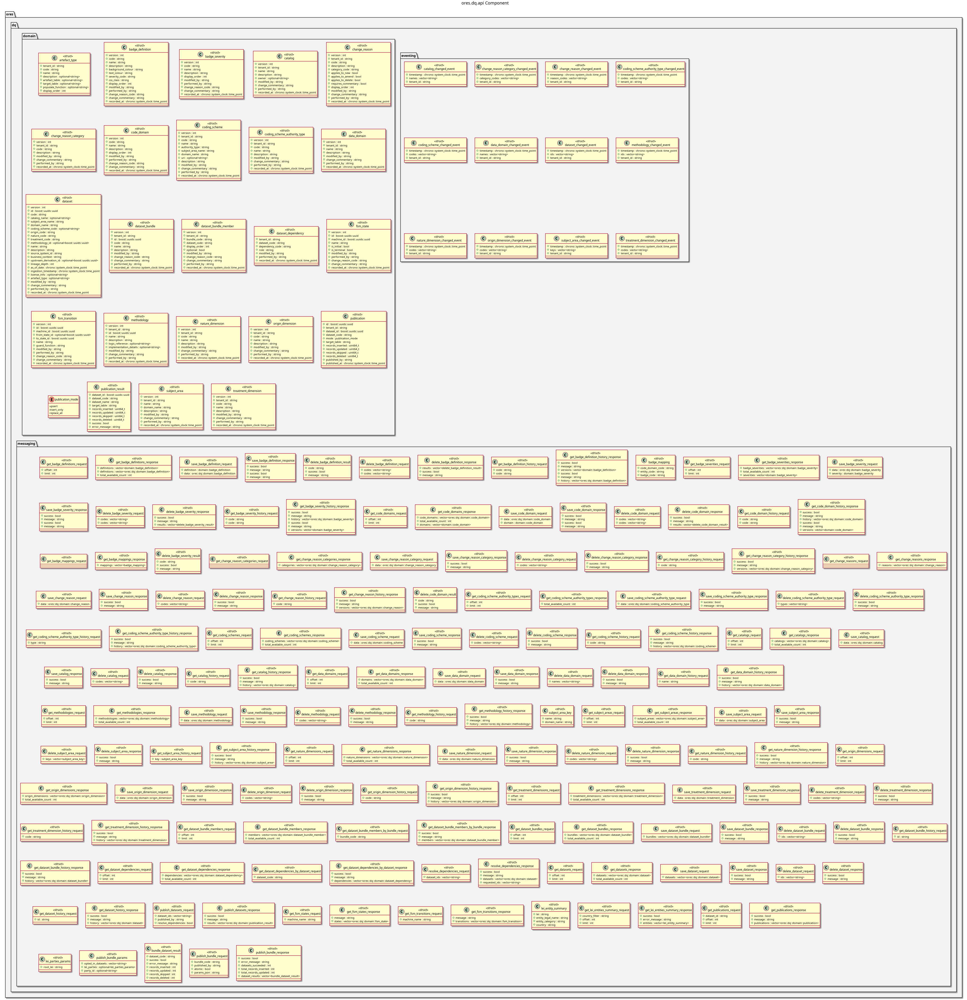

:PROPERTIES:
:ID: FFCFC860-204D-4F48-AE34-D3E382D7A02B
:END:
#+title: ores.dq.api
#+description: Domain types, JSON/table I/O, and NATS protocol schemas for the data-quality component.
#+type: ores.codegen.component
#+level: cross
#+filetags: :dq:api:component:
#+created: 2026-05-19
#+updated: 2026-05-19
#+name: dq.api
#+full_name: ores.dq.api
#+brief: Public API types for the data quality component.

* Diagram

#+attr_html: :width 100% :alt ores.dq.api component diagram
#+caption: ores.dq.api

* Summary

=ores.dq.api= is a header-only library defining the shared contract for the
data-quality domain. It provides domain types for badges, badge definitions,
datasets, dataset bundles, coding schemes, change-management records, and
artefact types, together with JSON and table I/O via =rfl=, and the NATS
message protocol schemas consumed by =ores.dq.core= and all domain components
that interact with the DQ system.

* Inputs

- Domain entity type definitions across =domain/= headers.
- NATS protocol message definitions.

* Outputs

- C++ headers for all DQ domain types with JSON and table I/O variants.
- NATS protocol headers for badge, dataset, and change-management operations.

* Entry points

- =include/ores.dq.api/domain/= — all domain entity headers.
- =include/ores.dq.api/messaging/= — NATS protocol message headers.

* Dependencies

- =rfl= — JSON serialisation via reflection.
- =fort= — formatted table rendering.

* See also

- [[id:AAF28605-81BE-4B7F-9B6E-7B9B1D99D7C3][ores.dq]] — component group overview.

- [[id:D3A9F7C2-8B14-4E5D-A6C9-1F7E2B0D8C4A][ores.dq.core]] — business logic, persistence, and NATS handlers.
- [[id:65D59476-A8DA-4461-9D82-A39B74F72316][ores.dq Messaging Reference]] — full NATS subject and message catalogue.
