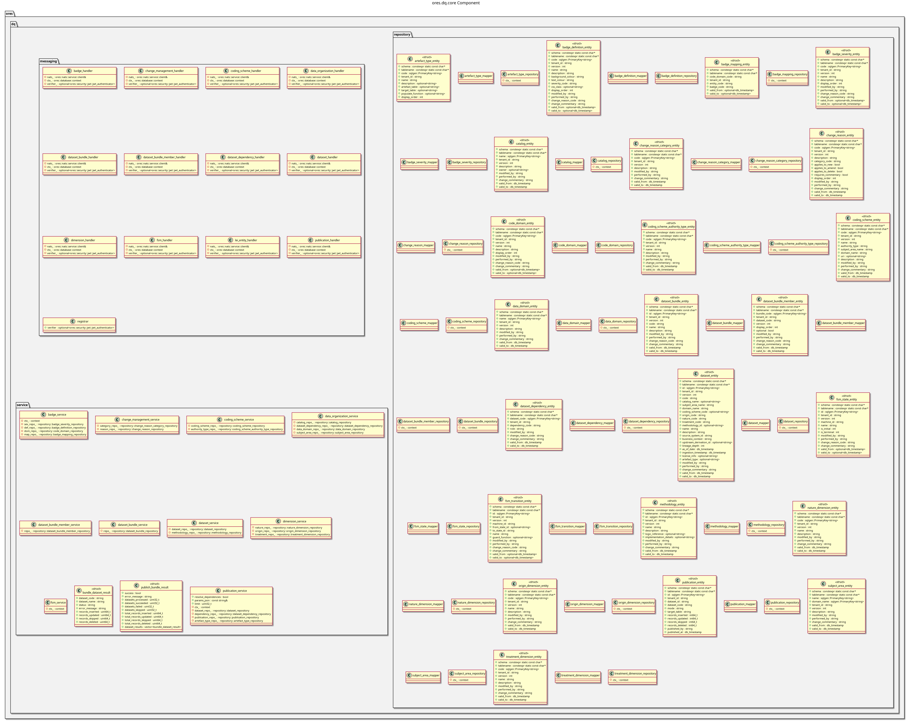

:PROPERTIES:
:ID: D3A9F7C2-8B14-4E5D-A6C9-1F7E2B0D8C4A
:END:
#+title: ores.dq.core
#+description: Data-quality infrastructure — badges, datasets, FSM, ORM base classes, and NATS handlers for ORE Studio.
#+type: ores.codegen.component
#+level: cross
#+filetags: :dq:core:component:
#+created: 2026-05-19
#+updated: 2026-05-19
#+name: dq.core
#+full_name: ores.dq.core
#+brief: Internal implementation of the data quality component.

* Diagram

#+attr_html: :width 100% :alt ores.dq.core component diagram
#+caption: ores.dq.core

* Summary

=ores.dq.core= is the data-quality infrastructure library for ORE Studio. It
provides the badge system (severity-tagged check results attached to datasets
and artefacts), dataset and dataset-bundle management, change-management
tracking, coding-scheme definitions, and the FSM / ORM base classes reused
by all other domain components. Business logic is exposed as NATS message
handlers; no other component in the system can own FSM transitions or ORM
persistence without depending on =ores.dq=.

* Inputs

- NATS request messages from Qt clients and peer services (badge queries,
  dataset/bundle CRUD, change-management events).
- PostgreSQL connections to =ores_dq_*= tables.
- Domain-specific events from trading, refdata, assets, and other components
  that trigger DQ population handlers.

* Outputs

- Badge and dataset records persisted to the =ores_dq= schema.
- NATS response messages for all DQ operations.
- ORM base classes, entity mappers, and FSM utilities consumed by
  =ores.trading.core=, =ores.refdata.core=, =ores.assets.core=, etc.

* Entry points

- =include/ores.dq.core/ores.dq.core.hpp= — aggregate include.
- =include/ores.dq.core/messaging/registrar.hpp= — registers all NATS
  handlers with the service host.
- =include/ores.dq.core/service/badge_service.hpp= — badge management.
- =include/ores.dq.core/service/dataset_service.hpp= — dataset lifecycle.

* Dependencies

- =ores.dq.api= — shared domain types and NATS protocol schemas.
- =ores.iam.core= — identity and authorisation context.
- =rfl= — JSON serialisation via reflection.
- =soci= — SQL ORM for PostgreSQL persistence.
- =nats.c= — NATS messaging client.

* See also

- [[id:AAF28605-81BE-4B7F-9B6E-7B9B1D99D7C3][ores.dq]] — component group overview.

- [[id:FFCFC860-204D-4F48-AE34-D3E382D7A02B][ores.dq.api]] — protocol types and domain entities.
- [[id:FA64A6DE-7010-4FD8-A1F8-D153B3CD96A9][ores.dq.service]] — NATS service entrypoint.
- [[id:65D59476-A8DA-4461-9D82-A39B74F72316][ores.dq Messaging Reference]] — full NATS subject and message catalogue.
