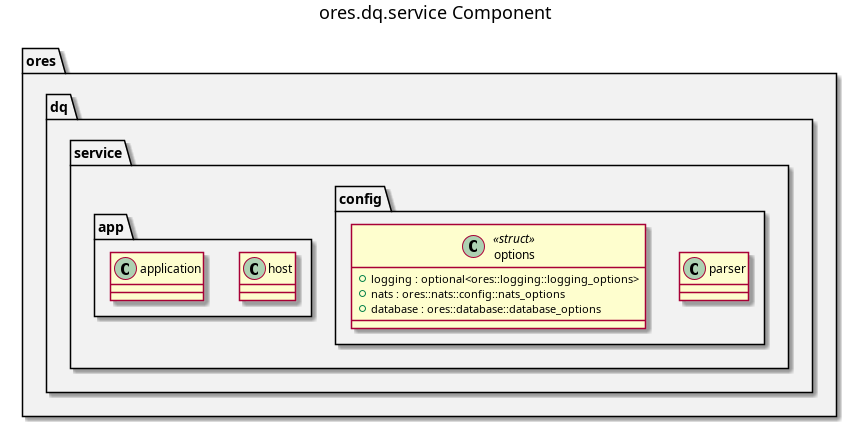

:PROPERTIES:
:ID: FA64A6DE-7010-4FD8-A1F8-D153B3CD96A9
:END:
#+title: ores.dq.service
#+description: NATS service entrypoint for the data-quality domain — wires handlers, repositories, and configuration.
#+type: ores.codegen.component
#+level: cross
#+filetags: :dq:service:component:
#+created: 2026-05-19
#+updated: 2026-05-19
#+name: dq.service
#+full_name: ores.dq.service
#+brief: Data quality service

* Diagram

#+attr_html: :width 100% :alt ores.dq.service component diagram
#+caption: ores.dq.service

* Summary

=ores.dq.service= is the NATS service entrypoint for the data-quality domain.
It reads configuration, opens database and NATS connections, registers all
message handlers from =ores.dq.core=, and runs the event loop. All business
logic lives in =ores.dq.core=; this component is responsible only for
bootstrap, dependency injection, and graceful shutdown.

* Inputs

- Configuration file: NATS server URL, PostgreSQL connection string, and
  environment settings.
- NATS request messages from Qt clients and peer services (badge, dataset,
  change-management operations).

* Outputs

- A running NATS service handling all data-quality operations.
- NATS response messages returned to callers.
- Structured logs via =ores.logging=.

* Entry points

- =src/main.cpp= — process entry point.
- =src/app/= — application bootstrap and dependency injection.
- =src/config/= — configuration parsing and validation.

* Dependencies

- =ores.dq.core= — all NATS handlers, repositories, and domain services.
- =ores.dq.api= — shared protocol types.
- =ores.logging= — structured logging infrastructure.
- =nats.c= — NATS client for connection management.

* See also

- [[id:AAF28605-81BE-4B7F-9B6E-7B9B1D99D7C3][ores.dq]] — component group overview.

- [[id:D3A9F7C2-8B14-4E5D-A6C9-1F7E2B0D8C4A][ores.dq.core]] — all business logic for the data-quality domain.
