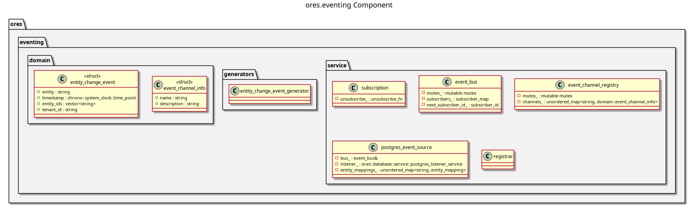

:PROPERTIES:
:ID: DDBC94C4-F350-478B-9E4C-643DEEA803B0
:END:
#+title: ores.eventing
#+description: In-process pub/sub event bus with PostgreSQL LISTEN/NOTIFY bridge for cross-service domain events.
#+type: component
#+version: 2
#+level: cross
#+filetags: :eventing:messaging:component:
#+created: 2026-05-20
#+updated: 2026-05-20

* Diagram

#+attr_html: :width 100% :alt ores.eventing component diagram
#+caption: ores.eventing

* Summary

=ores.eventing= provides an in-process publish/subscribe event bus for decoupled
communication between ORE Studio components. It defines type-safe event traits,
RAII subscription handles, and entity-change events. A PostgreSQL LISTEN/NOTIFY
bridge (=postgres_event_source=) translates database notifications into typed
in-process events, enabling services to react to cross-service state changes
without polling.

* Inputs

- Published domain events from any component calling =event_bus::publish=.
- PostgreSQL NOTIFY payloads forwarded by =postgres_event_source=.

* Outputs

- Type-safe callbacks delivered to registered subscribers.
- RAII subscription handles that unsubscribe on destruction.

* Entry points

- =include/ores.eventing/domain/= — event types, traits, entity change events.
- =include/ores.eventing/service/= — =event_bus=, =postgres_event_source=.

* Dependencies

- =ores.database= — =postgres_listener_service= for LISTEN/NOTIFY.
- =ores.logging= — structured logging.

* See also

-
