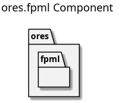

:PROPERTIES:
:ID: 7C2A8B4E-1F5D-4C9E-B8A2-7F1C3D5E6A9B
:END:
#+title: ores.fpml
#+name: fpml
#+full_name: ores.fpml
#+description: FpML processing infrastructure for parsing, validating, and archiving derivatives trade representations.
#+type: ores.codegen.component
#+level: cross
#+filetags: :fpml:finance:component:
#+created: 2026-05-20
#+updated: 2026-05-20

* Diagram

#+attr_html: :width 100% :alt ores.fpml component diagram
#+caption: ores.fpml

* Summary

=ores.fpml= is the infrastructure component for processing Financial Products
Markup Language (FpML) documents in ORE Studio. FpML is the ISDA XML standard
for representing OTC derivatives including interest rate swaps, credit
derivatives, FX, equity, and commodity instruments. The component provides the
namespace and integration point for FpML parsing, validation, and conversion
to internal trade representations used by =ores.trading=. It is currently in
early development — the namespace is established and the component stub is in
place.

* Inputs

- FpML XML documents representing OTC derivative trades and portfolios.

* Outputs

- Parsed and validated internal trade representations for consumption by
  =ores.trading=.

* Entry points

- =include/ores.fpml/ores.fpml.hpp= — component namespace entry point.

* Dependencies

- XML parsing library (e.g., =pugixml= or =libxml2=).
- =ores.trading.api= — internal trade representation types.

* See also

-
