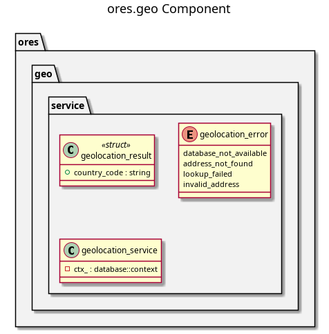

:PROPERTIES:
:ID: 8A1C5E2D-9B4F-4E8A-A7C3-6F2D1E0B9A5C
:END:
#+title: ores.geo
#+name: geo
#+full_name: ores.geo
#+description: Geolocation service that maps IP addresses to country and city using MaxMind GeoLite2-City data in PostgreSQL.
#+type: ores.codegen.component
#+level: cross
#+filetags: :geo:geolocation:component:
#+created: 2026-05-20
#+updated: 2026-05-20

* Diagram

#+attr_html: :width 100% :alt ores.geo component diagram
#+caption: ores.geo

* Summary

=ores.geo= provides IP-to-geographic-location lookups for ORE Studio. It stores
MaxMind GeoLite2-City data (countries, cities, IPv4/IPv6 CIDR blocks) in
PostgreSQL and exposes a =geolocation_service= that maps any IP address to
country, city, and coordinates. It is used by =ores.iam= to record the
geographic origin of login sessions for audit and security purposes.

* Inputs

- IP address (IPv4 or IPv6) from a login request or session context.
- MaxMind GeoLite2-City CSV data loaded into PostgreSQL tables
  (=geoip_locations=, =geoip_blocks_ipv4=, =geoip_blocks_ipv6=).

* Outputs

- Geographic location record: country, city, latitude/longitude for a given IP.

* Entry points

- =include/ores.geo/service/geolocation_service.hpp= — IP lookup API.

* Dependencies

- =ores.database= — PostgreSQL connection pool for =geoip_*= queries.
- PostgreSQL GiST indexes on =inet= columns for efficient CIDR matching.

* See also

-
