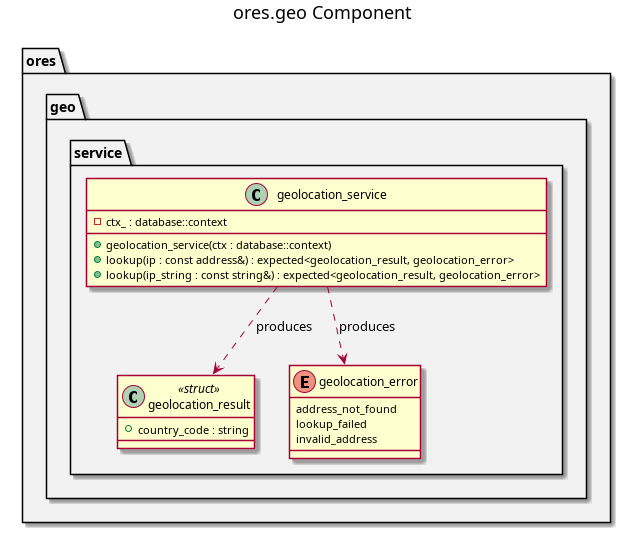

:PROPERTIES:
:ID: 8A1C5E2D-9B4F-4E8A-A7C3-6F2D1E0B9A5C
:END:
#+title: ores.geo
#+name: geo
#+full_name: ores.geo
#+description: Geolocation service that maps an IP address to a country code using ip2country data in PostgreSQL.
#+type: ores.codegen.component
#+level: cross
#+filetags: :geo:geolocation:component:
#+created: 2026-05-20
#+updated: 2026-09-26

* Diagram

#+attr_html: :width 100% :alt ores.geo component diagram
#+caption: ores.geo

* Summary

=ores.geo= answers one question: which country does this IP address belong to.
It reads =ores_geo_ip2country_tbl= in PostgreSQL through the
=ores_geo_ip2country_lookup_fn= function, and exposes a =geolocation_service=
that returns an ISO 3166-1 alpha-2 country code. The data source is
ip2country, so the answer is country-level only; city and coordinate data are
not available. =ores.http= constructs the service and calls it from its login
route, and no other component consumes it.

* Inputs

- An IP address, IPv4 or IPv6, as a =boost::asio::ip::address= or a string.
- ip2country ranges in =ores_geo_ip2country_tbl=, written by the dq ip2country
  publish path. No recreate step runs that path, so a database built from
  scratch answers =address_not_found= until a publish has run.
- A =database::context= for the PostgreSQL connection.

* Outputs

- =geolocation_result=, holding the ISO 3166-1 alpha-2 country code.
- A =geolocation_error= when the lookup cannot answer: =address_not_found= when
  no range covers the address, =invalid_address= when a string is not an
  address, or =lookup_failed= when the query throws.

* Entry points

- =include/ores.geo/service/geolocation_service.hpp= — the lookup API.

* Dependencies

- =ores.database= — the connection pool and the raw multi-column query helper.
- =ores_geo_ip2country_lookup_fn= over =ores_geo_ip2country_tbl=, defined
  under =projects/ores.sql/create/geo/=.

* See also

- [[id:3A8F2E91-D4C7-8AB4-5E23-91D6F8C04A72][ores.database]] — the connection and query layer the service reads through.
- [[id:869526B6-6C82-430E-95E1-776D4A11A56B][ores.http.core]] — the login route that calls the lookup.
- [[id:A8B318BC-8653-4D33-A58C-60793E3596D5][ores.http.server]] — the process that constructs the service.
- [[id:C5F35442-A2C3-415A-80F2-C09CAA0842FF][System Model: Foundation Layer]] — the layer this component belongs to.
