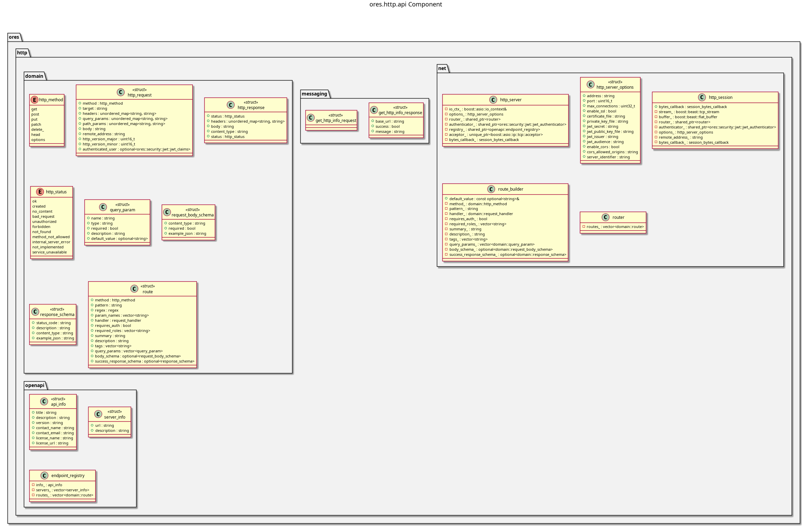

:PROPERTIES:
:ID: B0C9FDC8-F0B2-48FE-AE37-8FD79E6FD164
:END:
#+title: ores.http.api
#+name: http.api
#+full_name: ores.http.api
#+description: HTTP server library — Boost.Beast server, JWT authentication, routing, and OpenAPI support.
#+type: ores.codegen.component
#+level: cross
#+filetags: :http:api:component:
#+created: 2026-05-19
#+updated: 2026-05-19

* Diagram

#+attr_html: :width 100% :alt ores.http.api component diagram
#+caption: ores.http.api

* Summary

=ores.http.api= is the primary HTTP infrastructure library for ORE Studio. It
provides an asynchronous HTTP/1.1 server built on Boost.Beast and Boost.Asio,
JWT authentication middleware (parsing, validation, and claims extraction),
path-based routing, an OpenAPI endpoint registry, and all domain types for HTTP
request/response and JWT claims. This is the foundation for the REST-API surface
exposed to external clients (web, mobile) alongside the NATS-based internal API.

* Inputs

- Incoming HTTP requests on the configured TCP port.
- JWT tokens in the =Authorization: Bearer= header for authenticated routes.
- Configuration: bind address, port, JWT public key.

* Outputs

- HTTP responses to clients.
- Parsed JWT claims injected into request context for downstream handlers.
- OpenAPI endpoint registry used to generate =openapi.json= at runtime.

* Entry points

- =include/ores.http.api/net/http_server.hpp= — server lifecycle management.
- =include/ores.http.api/net/router.hpp= — route registration and dispatch.
- =include/ores.http.api/domain/= — HTTP and JWT domain types.
- =include/ores.http.api/openapi/= — OpenAPI endpoint registry.
- =include/ores.http.api/messaging/= — any NATS protocol schemas for HTTP bridge.

* Dependencies

- Boost.Beast, Boost.Asio — async HTTP server.
- =nlohmann/json= or =rfl= — JWT claim serialisation.
- =ores.iam.api= — JWT claims types aligned with IAM sessions.

* See also

- [[id:869526B6-6C82-430E-95E1-776D4A11A56B][ores.http.core]] — concrete route implementations (IAM, assets, risk, etc.).
- [[id:A8B318BC-8653-4D33-A58C-60793E3596D5][ores.http.server]] — server entrypoint.
