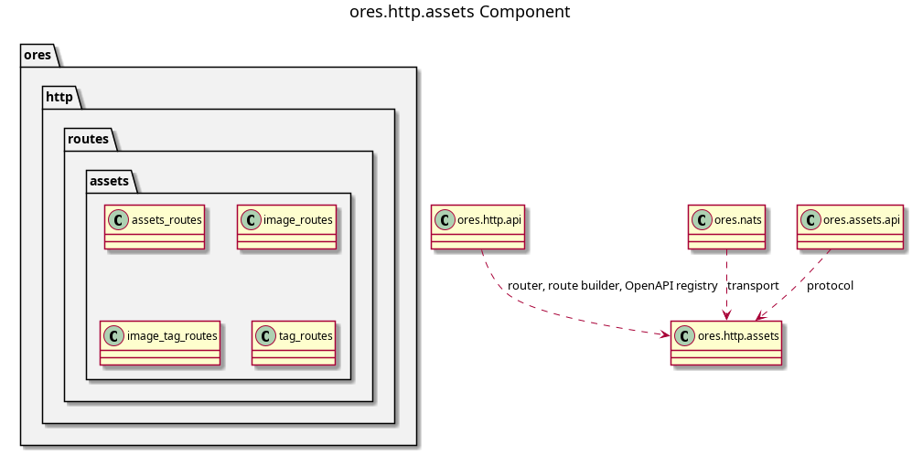

:PROPERTIES:
:ID: 66E4F171-4D0C-4081-8C76-E5459AD2A516
:END:
#+title: ores.http.assets
#+description: The HTTP gateway's assets adapter part. Holds the generated route units that project the assets domain onto the REST surface.
#+type: ores.codegen.component
#+component_kind: adapter
#+level: cross
#+filetags: :http:rest:assets:component:
#+created: 2026-09-26
#+updated: 2026-09-26
#+name: assets
#+full_name: ores.http.assets
#+brief: HTTP assets route units

* Diagram

#+attr_html: :width 100% :alt ores.http.assets component diagram
#+caption: ores.http.assets

* Summary

=ores.http.assets= is the adapter part that projects the assets domain onto
the HTTP server's REST surface. It holds the generated route units for the
assets models that opt in, and each unit owns one route per derived verb.

Assets' models opt in through the =:ores.cpp.http-route.enabled:= property in
their own model drawer, so a model that needs no route can leave the facet
off. The units speak the canonical protocol over NATS and hold no service,
repository or database context: the assets service stays the only place that
decides, and the caller's own token travels with every forwarded request.

The part declares =#+component_kind: adapter=. Its =CMakeLists.txt= files are
hand-authored, because the link libraries belong to the HTTP surface rather
than to the domain, and codegen writes only the two =component_files.cmake=
lists. A regeneration therefore never writes over the build.

The units are output of the =ores.cpp.http-route= facet, which is opt-in per
model. The facet writes here because the part is named after the domain the
units project, which is the fractal naming rule in
[[id:F27E5DF7-6223-4B6F-80A5-CEFBEB1BC756][Component architecture]].

* Inputs

- HTTP requests on the =/api/v1/assets/...= paths the units register.
- The caller's bearer token, forwarded to the service on every NATS request.
- The connected NATS client the hand-written per-component aggregator passes
  to =register_routes=.
- The assets models under =projects/ores.assets/modeling/= whose drawers opt
  in to the =ores.cpp.http-route= facet.

* Outputs

- One route unit per opted-in model, at
  =src/routes/assets/<unit>_routes.cpp= and
  =include/ores.http/routes/assets/<unit>_routes.hpp=.
- The routes and their OpenAPI schemas, registered on the router and the
  endpoint registry.
- NATS request messages to the assets service, one per route.

* Entry points

- =include/ores.http/routes/assets/= -- the generated unit headers.
- =src/routes/assets/= -- the generated unit implementations.
- =image_routes=, =image_tag_routes= and =tag_routes= -- the unit-level
  entries the host calls to install each entity's routes.

* Dependencies

- =ores.http.api= -- the router, the route builder, the OpenAPI registry and
  the request/response types.
- =ores.nats= -- NATS transport for service calls.
- =ores.assets.api= -- the canonical protocol messages the units send.
- =ores.utility= -- the rfl reflectors and the wire support types.
- =ores.logging= -- logger factory.

* See also

- [[id:A8B318BC-8653-4D33-A58C-60793E3596D5][ores.http.server]] -- the process that will host these routes.
- [[id:1EBDA080-07F6-496D-AA4A-72899E65641C][ores.cpp.http-route]] -- the facet that emits the units.
- [[id:F27E5DF7-6223-4B6F-80A5-CEFBEB1BC756][Component architecture]] -- the composite and adapter kinds.
- [[id:8C604D55-6F20-41D2-A66A-12A767B81D07][ores.assets]] -- the domain this part projects.
