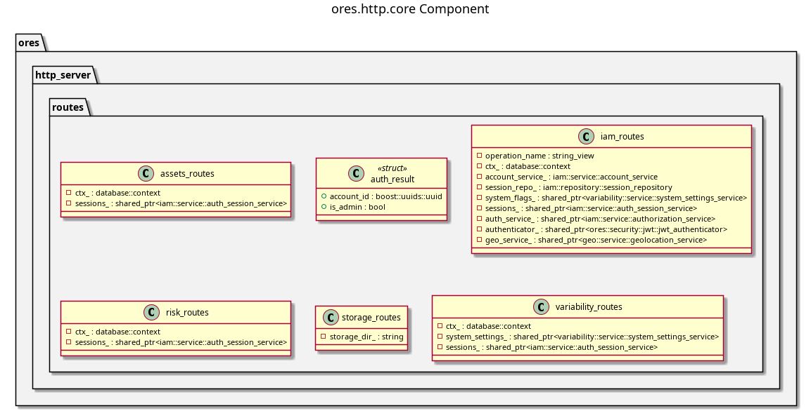

:PROPERTIES:
:ID: 869526B6-6C82-430E-95E1-776D4A11A56B
:END:
#+title: ores.http.core
#+name: http.core
#+full_name: ores.http.core
#+description: HTTP route implementations for the ORE Studio REST API — IAM, assets, risk, storage, and variability routes.
#+type: ores.codegen.component
#+level: cross
#+filetags: :http:core:component:
#+created: 2026-05-19
#+updated: 2026-05-19

* Diagram

#+attr_html: :width 100% :alt ores.http.core component diagram
#+caption: ores.http.core

* Summary

=ores.http.core= implements the concrete HTTP route handlers for the ORE Studio
REST API. It registers routes for each domain: IAM (login, session), assets
(image serving), risk (report execution), storage, and variability
(configuration). Each route handler translates the incoming HTTP request into
NATS calls to the appropriate domain service and returns the NATS response as
an HTTP response.

* Inputs

- Incoming HTTP requests dispatched from =ores.http.api= router.
- NATS responses from =ores.iam.service=, =ores.assets.service=,
  =ores.reporting.service=, etc.

* Outputs

- HTTP responses constructed from NATS domain service responses.
- Route registrations added to the =ores.http.api= router and OpenAPI registry.

* Entry points

- =include/ores.http.core/routes/iam_routes.hpp= — IAM endpoint handlers.
- =include/ores.http.core/routes/assets_routes.hpp= — assets endpoint handlers.
- =include/ores.http.core/routes/risk_routes.hpp= — risk/reporting handlers.
- =include/ores.http.core/routes/variability_routes.hpp= — config handlers.
- =include/ores.http.core/routes/storage_routes.hpp= — storage handlers.

* Dependencies

- =ores.http.api= — server infrastructure, router, JWT claims.
- =ores.iam.api=, =ores.assets.api=, =ores.reporting.api=, =ores.variability.api=
  — NATS protocol types for each domain service called.
- =nats.c= — NATS client for forwarding requests.

* See also

- [[id:B0C9FDC8-F0B2-48FE-AE37-8FD79E6FD164][ores.http.api]] — server infrastructure this library builds on.
- [[id:A8B318BC-8653-4D33-A58C-60793E3596D5][ores.http.server]] — server entrypoint that wires these routes.
