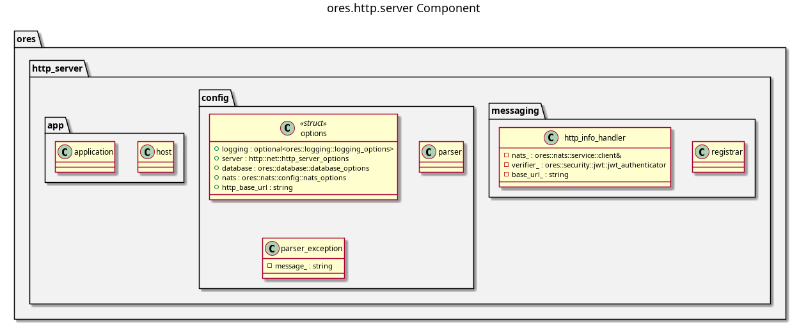

:PROPERTIES:
:ID: A8B318BC-8653-4D33-A58C-60793E3596D5
:END:
#+title: ores.http.server
#+name: http.server
#+full_name: ores.http.server
#+description: HTTP server entrypoint — wires HTTP routes and runs the Boost.Asio event loop.
#+type: ores.codegen.component
#+level: cross
#+filetags: :http:server:component:
#+created: 2026-05-19
#+updated: 2026-05-19

* Diagram

#+attr_html: :width 100% :alt ores.http.server component diagram
#+caption: ores.http.server

* Summary

=ores.http.server= is the HTTP server process entrypoint for ORE Studio. It
reads configuration, opens NATS connections for domain service calls, registers
all route handlers from =ores.http.core=, and starts the Boost.Asio event loop
to serve HTTP requests. It is the process external REST clients connect to.

* Inputs

- Configuration file: bind address, port, JWT public key, NATS server URL.
- Incoming TCP connections from external HTTP clients.

* Outputs

- A running HTTP/1.1 server on the configured address/port.
- HTTP responses forwarded from NATS domain services via =ores.http.core= routes.

* Entry points

- =src/main.cpp= — process entry point.
- =src/app/= — bootstrap and route wiring.
- =src/config/= — configuration parsing.

* Dependencies

- =ores.http.core= — all route implementations.
- =ores.http.api= — server infrastructure (Boost.Beast/Asio).
- =ores.logging=, =nats.c=.

* See also

- [[id:B0C9FDC8-F0B2-48FE-AE37-8FD79E6FD164][ores.http.api]] — HTTP server library this entrypoint uses.
- [[id:869526B6-6C82-430E-95E1-776D4A11A56B][ores.http.core]] — all route implementations wired here.
