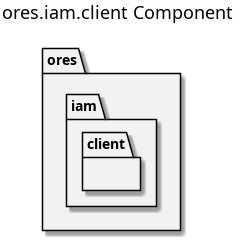

:PROPERTIES:
:ID: 28A7AF22-1EB1-4989-B4BD-A383D09605F3
:END:
#+title: ores.iam.client
#+name: iam.client
#+full_name: ores.iam.client
#+description: Client-side IAM library — session management and authentication helper for Qt and service consumers.
#+type: ores.codegen.component
#+level: cross
#+filetags: :iam:client:component:
#+created: 2026-05-19
#+updated: 2026-05-19

* Diagram

#+attr_html: :width 100% :alt ores.iam.client component diagram
#+caption: ores.iam.client

* Summary

=ores.iam.client= is a lightweight client-side library that manages IAM session
state for Qt components and other service consumers. It provides a
=service_token_provider= that holds an authenticated session token, handles
token renewal, and supplies the token to outgoing NATS requests. It abstracts
the IAM authentication protocol so consumers do not need to implement the
login flow directly.

* Inputs

- NATS connection and configuration from the host application.
- Authentication credentials (account/password or token) from the caller.

* Outputs

- A valid session token injected into outgoing NATS request headers.
- Token-renewal events when sessions approach expiry.

* Entry points

- =include/ores.iam.client/client/service_token_provider.hpp= — token
  management and renewal entry point.

* Dependencies

- =ores.iam.api= — shared domain types and NATS protocol schemas.
- =nats.c= — NATS messaging client.

* See also

- [[id:BD9653B7-C92B-4A71-9B5D-7ADB4EBCB94F][ores.iam]] — component group overview.

- [[id:D00BEA0D-E501-C534-A013-E6F40C1A6097][ores.iam.core]] — server-side IAM business logic.
- [[id:AAD74D7C-4789-4E54-8B02-EC60231D78A5][Multi-Party Login Flow]] — authentication sequence this client implements.
