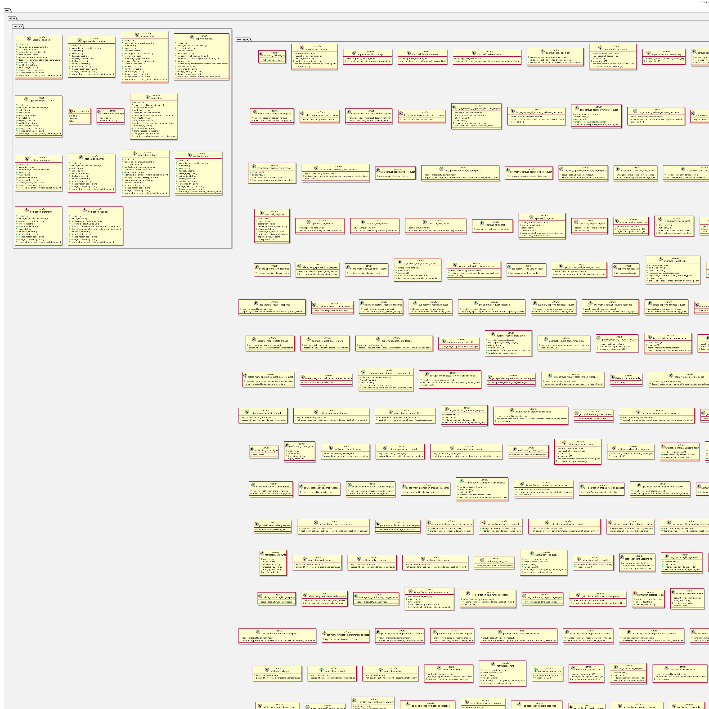

:PROPERTIES:
:ID: 0241FD4B-59BB-44FC-81A5-B4D0192F93D4
:END:
#+title: ores.inbox.api
#+description: Domain types, JSON I/O and NATS protocol schemas for approval requests and notifications.
#+type: ores.codegen.component
#+component_kind: api
#+level: cross
#+filetags: :inbox:api:component:
#+created: 2026-10-04
#+updated: 2026-10-04
#+name: inbox.api
#+full_name: ores.inbox.api
#+brief: Approval and notification contract

* Diagram

#+attr_html: :width 100% :alt ores.inbox.api component diagram
#+caption: ores.inbox.api

* Summary

=ores.inbox.api= is the contract of the inbox: the domain types of the approval
requests and the notifications, their JSON I/O, and the NATS protocol both the
server and its clients use. Every type is generated from the codegen models.

* Inputs

- The codegen models under =projects/ores.inbox/modeling/=.

* Outputs

- Domain headers under =include/ores.inbox.api/domain/= and the protocol under
  =include/ores.inbox.api/messaging/=.

* Entry points

- =include/ores.inbox.api/ores.inbox.api.hpp= — the umbrella header.

* Dependencies

- =ores.utility= — shared domain types and the protocol envelope.

* See also

- =ores.inbox.core= — the implementation this contract describes.
