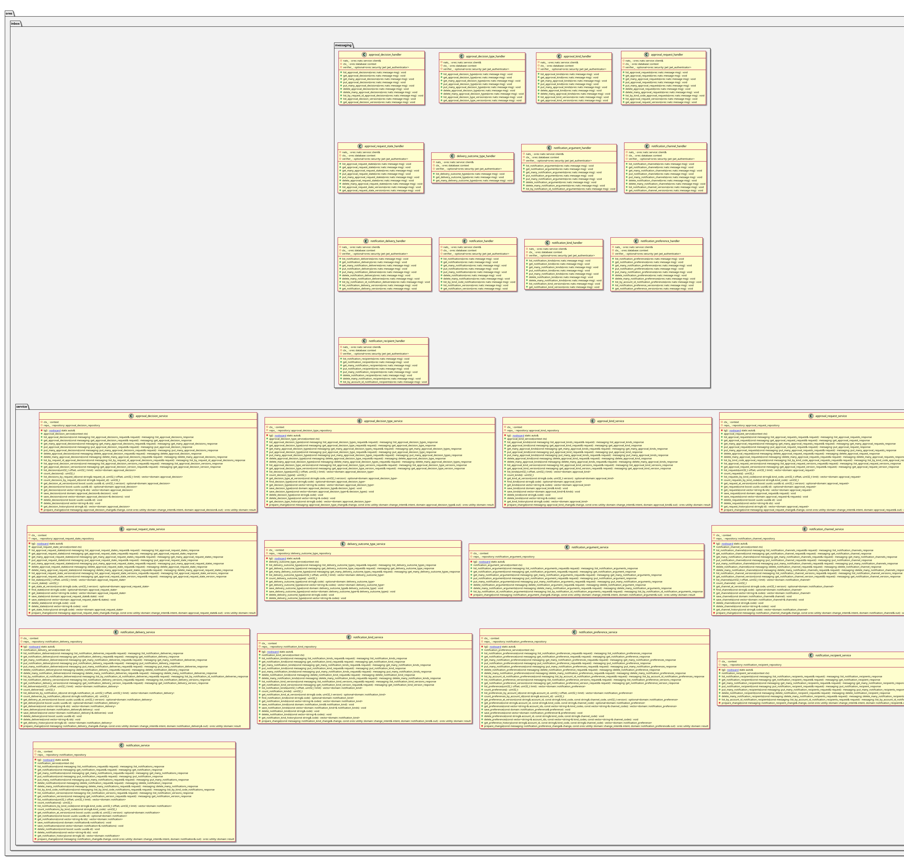

:PROPERTIES:
:ID: 8B89B1C4-0410-4967-BBE1-02F6630B8A35
:END:
#+title: ores.inbox.core
#+description: Approval requests and notifications: repositories, services and NATS handlers.
#+type: ores.codegen.component
#+component_kind: core
#+level: cross
#+filetags: :inbox:core:component:
#+created: 2026-10-04
#+updated: 2026-10-04
#+name: inbox.core
#+full_name: ores.inbox.core
#+brief: Approval and notification core

* Diagram

#+attr_html: :width 100% :alt ores.inbox.core component diagram
#+caption: ores.inbox.core

* Summary

=ores.inbox.core= implements the inbox: the repositories over the approval and
notification tables, the services that enforce the approval rules and resolve a
notification's audience, and the NATS handlers that serve them.

* Inputs

- NATS requests on the inbox subjects.
- The approval and notification tables in PostgreSQL.

* Outputs

- Replies to the inbox subjects, and change events on every entity.

* Entry points

- =include/ores.inbox.core/repository/= — the generated repositories.
- =include/ores.inbox.core/service/= — the services.
- =include/ores.inbox.core/messaging/= — the NATS handlers and their registrar.

* Dependencies

- =ores.inbox.api= — the contract.
- =ores.iam.core= — the request context and permission checks.
- =ores.database= — persistence.

* Build dependencies

What the shared component profile cannot know, declared here rather than
hand-edited into the generated build file. Each block is spliced into its
generated file after the profile's baseline. The history provider registrars
need the history dispatch registry and the diff types it carries. The
approval lifecycle reads the signed-in account from IAM, and the operation
handlers use the shared request and reply helpers.

#+begin_src cmake :name extra_dependencies
target_link_libraries(${lib_target_name}
    PRIVATE
        ores.history.core.lib
        ores.diff.lib
        ores.iam.core.lib
        ores.service.lib)
#+end_src

The generated eventing tests assemble the database-to-NATS chain by hand and
seed the IAM accounts and permissions the inbox rows reference, and the
handler tests use the shared request and reply helpers.

#+begin_src cmake :name extra_test_dependencies
target_link_libraries(${tests_target_name}
    PRIVATE
        ores.eventing.api.lib
        ores.eventing.core.lib
        ores.iam.api.lib
        ores.iam.core.lib
        ores.nats.lib
        ores.service.lib
        ores.utility.lib)
#+end_src

* See also

- =ores.inbox.service= — the process that hosts these handlers.
