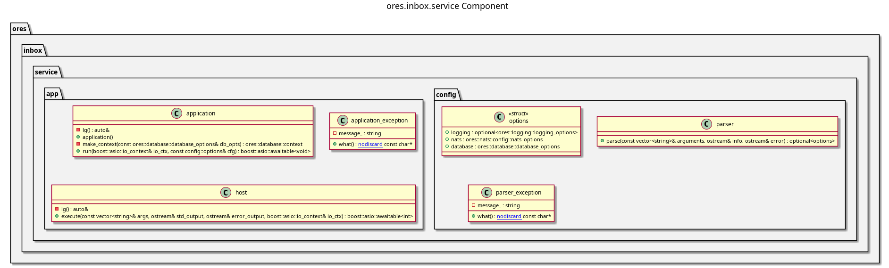

:PROPERTIES:
:ID: 1C966173-16C3-4B5D-A396-AD73DB80B7F8
:ores.cpp.scaffold.enabled: true
:END:
#+title: ores.inbox.service
#+description: NATS service entrypoint for approval requests and notifications.
#+type: ores.codegen.component
#+component_kind: service
#+level: cross
#+filetags: :inbox:service:component:
#+created: 2026-10-04
#+updated: 2026-10-04
#+name: inbox.service
#+full_name: ores.inbox.service
#+brief: Approval and notification service

* Diagram

#+attr_html: :width 100% :alt ores.inbox.service component diagram
#+caption: ores.inbox.service

* Summary

=ores.inbox.service= is the process that answers the inbox subjects over NATS:
it reads its configuration, connects to NATS and the database, and registers
the core's handlers.

* Inputs

- Command-line options and the environment.

* Outputs

- A running NATS service for the inbox subjects.

* Entry points

- =src/main.cpp= — the process entry point.
- =src/app/application.cpp= — wiring the handlers.

* Dependencies

- =ores.inbox.core= — the handlers.
- =ores.service= — the service host.

* See also

- =ores.inbox.core= — what this service hosts.
