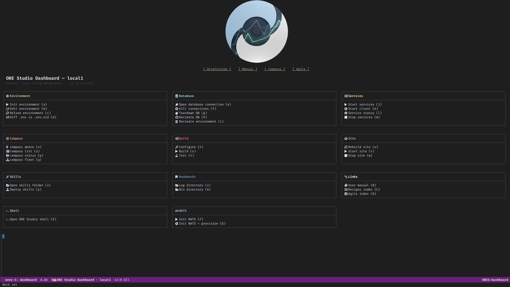

:PROPERTIES:
:ID: EAE593F5-B549-4705-A598-344405196574
:END:
#+title: ores.lisp
#+name: lisp
#+full_name: ores.lisp
#+description: Emacs Lisp developer tooling for ORE Studio — dashboard, database browser, shell integration, and org-roam export.
#+type: ores.codegen.component
#+level: cross
#+filetags: :lisp:tooling:emacs:component:
#+created: 2026-05-25
#+updated: 2026-05-25

* Dashboard

#+attr_html: :width 100% :alt ORE Studio Dashboard
#+caption: ORE Studio Dashboard

* Summary

=ores.lisp= is the Emacs Lisp tooling layer for ORE Studio development. It
provides a per-checkout interactive console (=ores-dashboard=), database
management UI (=ores-db=), shell integration (=ores-shell=), environment
loading (=ores-env=), org-roam export pipeline (=ores-org-roam-export=),
and process supervision via Prodigy (=ores-prodigy=). None of these modules
are part of the production system; they exist solely to improve developer
ergonomics.

* Inputs

- =.env= — checkout-specific environment variables (label, preset, passwords,
  per-service DB credentials).
- =sql-connection-alist= — populated at session start via =ores-db/setup-connections=.
- =build/scripts/= — shell scripts invoked for init, build, site, NATS, and DB
  operations.

* Outputs

- =ORES Dashboard= Emacs buffer — interactive card-based console with
  keyboard shortcuts for every action.
- =*ores-<label>-db-<svc>*= SQL interaction buffers.
- =*ores-<label>-shell*= ores.shell REPL buffer.
- Compilation buffers for build, site, services, and DB scripts.
- Org-roam HTML export artefacts (via =ores-org-roam-export=).

* Entry points

- =M-x ores/dashboard= — primary developer console; opens the =ORES Dashboard= card layout.
- =M-x ores-db/list-databases= — tabulated database browser; list, connect, kill, teardown, and recreate.
- =M-x ores-shell= — launch (or switch to) an =ores.shell= REPL comint buffer.
- =M-x ores/capture= — capture a product-backlog note via =compass.sh capture --note= (CLI-driven; for interactive Org Capture use yasnippet trigger =cap= in an =.org= buffer).

* Source files

- =ores-env.el= — parses the checkout =.env= file into an alist and exposes
  =ores/load-dotenv= and =ores/checkout-root=. Foundation module; required by
  all others.
- =ores-dashboard.el= — per-checkout interactive development console. Renders
  a card-based layout (Environment, Database, Services, Compass, Build, Site,
  Skills, Bookmarks, Links, Shell, NATS) with global keyboard shortcuts
  (=a=–=z=, =A=–=Z=). Entry point: =M-x ores/dashboard=.
- =ores-db.el= — tabulated database browser and SQL connection manager.
  Discovers all =ores_*= databases on localhost, supports connect, kill
  connections, teardown, and recreate operations. Entry point:
  =M-x ores-db/list-databases=.
- =ores-shell.el= — launches an =ores.shell= REPL as a comint buffer, pointed
  at the preset's published binary. Entry point: =M-x ores-shell=.
- =ores-shell-mode.el= — trivial major mode for the =ores.shell= REPL buffer.
  Provides font-lock highlighting for shell commands (=connect=, =login=,
  =accounts=, =create=, =exit=) so they stand out from arguments.
- =ores-babel.el= — configures Org Babel =#+begin_src sh= blocks in recipe
  files to run with =default-directory= set to the repo root, so paths like
  =./projects/ores.compass/compass.sh= resolve consistently regardless of
  where the =.org= file lives.
- =ores-prodigy.el= — registers all ORE Studio background services
  (databases, NATS, HTTP server, domain services) with Prodigy for
  point-and-click process lifecycle management.
- =ores-capture.el= — product-backlog capture integration. Provides
  =ores/setup-capture-templates= (registers key ="c"= in
  =org-capture-templates=; creates a timestamped file in =inbox/= and
  expands the =capture= yasnippet for interactive filling via TAB)
  and =ores/capture= (interactive command that delegates to =compass.sh
  capture --note=; for LLM-driven and CLI-style use). The yasnippet
  at =snippets/org-mode/capture= (trigger ="cap"=) is the single
  template source shared by both entry points.
- =ores-org-roam-export.el= — org-roam → HTML export pipeline; walks the
  node graph and publishes the documentation site.

* Dependencies

- =sql-mode= (Emacs built-in) — interactive SQL buffers.
- =nerd-icons= — icon glyphs in the dashboard.
- =org-roam= — node graph for export pipeline.
- =prodigy= — service process management.
- =compilation-mode= (Emacs built-in) — script output buffers.

* Dashboard functionality

The =ORES Dashboard= buffer is divided into cards. Each card groups related
actions under a short heading and maps them to single-keystroke bindings.

| Card        | Key(s)       | What it does                                                                 |
|-------------+--------------+------------------------------------------------------------------------------|
| Environment | =e=          | Display the loaded =.env= values (label, preset, credentials).              |
| Database    | =d=, =k=, =t=, =r= | Connect to a DB, kill connections, teardown schema, recreate schema.  |
| Services    | =p=          | Open Prodigy process manager (NATS, HTTP server, domain services).          |
| Compass     | =c=          | Run a =compass search= query; output appears in the output pane.            |
| Build       | =b=          | Invoke =cmake --build= for the current preset.                              |
| Site        | =s=          | Run =deploy_site= (Emacs batch, org → HTML + graph export).                 |
| Skills      | =S=          | Run =deploy_skills= (tangle Claude Code skills from Org Babel blocks).      |
| Bookmarks   | =o=          | Jump to a frequently-used file or directory.                                |
| Links       | =l=          | Open a curated list of project web links (GitHub, site, Doxygen).           |
| Shell       | =x=          | Launch (or switch to) an =ores.shell= REPL comint buffer.                   |
| NATS        | =n=          | Send a test NATS message or open the NATS monitoring page.                  |

* See also

- [[id:E19E9FDE-4743-4B2E-8724-6369B3E43131][ORE Studio Site]] — how the site is built, the menu bar definition, the 404 page, and the org-roam graph injection.
- [[id:E71704D9-60D4-4898-AF25-B6B07101DB90][ORE Studio Manual]] — how the PDF user manual is built via ox-latex, Tufte layout, margin figures, and version stamping.
- [[id:DF6F1D17-2199-472C-868E-1E50D0887AAD][Emacs]] — editor overview and the build targets (=deploy_site=, =deploy_manual=, etc.) that =ores.lisp= scripts drive.
- [[id:C53486A1-54A3-4FD3-BC5F-15F4CE6BC4ED][org-roam]] — the knowledge graph layer that =ores-org-roam-export.el= exports.
- [[id:D773166D-0C91-8CB4-3323-42166BC07687][System Model]] — architectural context.
- [[id:D0876A24-69BA-F484-ED9B-71CD3AA8710C][ores.shell]] — the REPL that the dashboard launches.
- [[id:B7E9F3A1-C8D2-4E6B-A1F5-9D3C7E8B2A4F][ores.sql]] — database scripts invoked by the dashboard.
