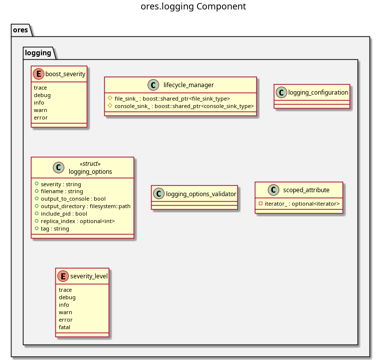

:PROPERTIES:
:ID: 1FBCC86B-8E04-4F81-8558-85C0B6C54836
:END:
#+title: ores.logging
#+name: logging
#+full_name: ores.logging
#+description: Core logging library on Boost.Log — severity levels, logger factory, and lifecycle management for all ORE Studio components.
#+type: ores.codegen.component
#+level: cross
#+filetags: :logging:infrastructure:component:
#+created: 2026-05-20
#+updated: 2026-05-20

* Diagram

#+attr_html: :width 100% :alt ores.logging component diagram
#+caption: ores.logging

* Summary

=ores.logging= is the core logging library for all ORE Studio components. It
wraps Boost.Log with a =make_logger()= factory, OpenTelemetry-compatible
severity levels, and a =lifecycle_manager= virtual base for console and file
sink configuration. It was extracted from =ores.telemetry= specifically to
break the circular dependency that arose when =ores.database= needed logging
but =ores.telemetry= depended on =ores.database=. All services and libraries
depend on =ores.logging=; =ores.telemetry= extends it with OTLP export and
trace correlation.

* Inputs

- Logging options from command-line or configuration (sink type, log level,
  file path).

* Outputs

- Named =boost::log= logger instances for use across components.
- Log records emitted to console and/or file sinks.

* Entry points

- =include/ores.logging/make_logger.hpp= — logger factory.
- =include/ores.logging/severity_level.hpp= — severity level enum.
- =include/ores.logging/lifecycle_manager.hpp= — sink lifecycle base class.
- =include/ores.logging/logging_options.hpp= — parsed logging configuration.

* Dependencies

- Boost.Log — logging back-end.

* See also

-
