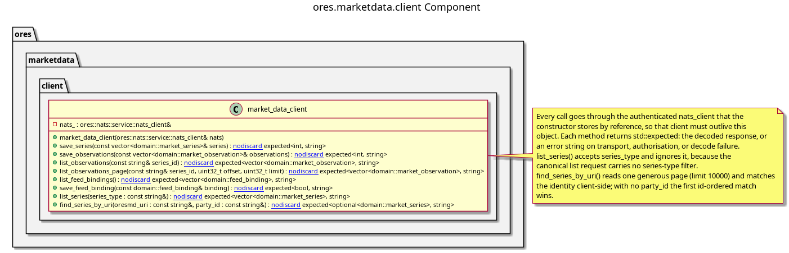

:PROPERTIES:
:ID: EBFDA8AD-34C6-4A28-AAB2-89FD3D3E9808
:END:
#+title: ores.marketdata.client
#+description: Client-side NATS wrapper for the marketdata service: request/response helpers and market data subscriptions.
#+type: ores.codegen.component
#+level: cross
#+filetags: :marketdata:client:component:
#+created: 2026-07-29
#+updated: 2026-09-27
#+name: marketdata.client
#+full_name: ores.marketdata.client
#+brief: Market data client

* Diagram

#+attr_html: :width 100% :alt ores.marketdata.client component diagram
#+caption: ores.marketdata.client

* Summary

=ores.marketdata.client= is the typed, authenticated facade non-UI
consumers use to reach the market-data service. =market_data_client=
centralises the request/response round trip and the service authentication,
so a caller states what it wants rather than hand-rolling a subject, an rfl
payload and an auth header. =fx_spot_subscription= is the streaming half: it
translates an ORE key plus the consuming (tenant, party) context
into the per-party tick subject and delivers decoded ticks to a callback.
Both take a connected =nats_client= and own no state beyond it.

* Inputs

- A connected, authenticated =ores::nats::service::nats_client=.
- An ORE canonical key (for example =FX/RATE/EUR/USD=) plus the tenant
  and party the caller consumes as.

* Outputs

- Decoded protocol responses: market series, observations and feed bindings.
- Decoded =fx_spot_tick= values delivered to a caller-supplied handler.

* Entry points

- =include/ores.marketdata.client/market_data_client.hpp=,
  =include/ores.marketdata.client/fx_spot_subscription.hpp=.

* Dependencies

- =ores.nats= for the transport and the wire codec.
- =ores.marketdata.api= for the protocol and domain types.

* See also

- [[id:759530D8-2314-44F3-A50E-71CE7AD02558][ores.marketdata.core]] — the handlers these requests reach.
- [[id:57182ECE-6364-421A-A46F-73841F9961B4][ores.marketdata.service]] — the process that composes them.
