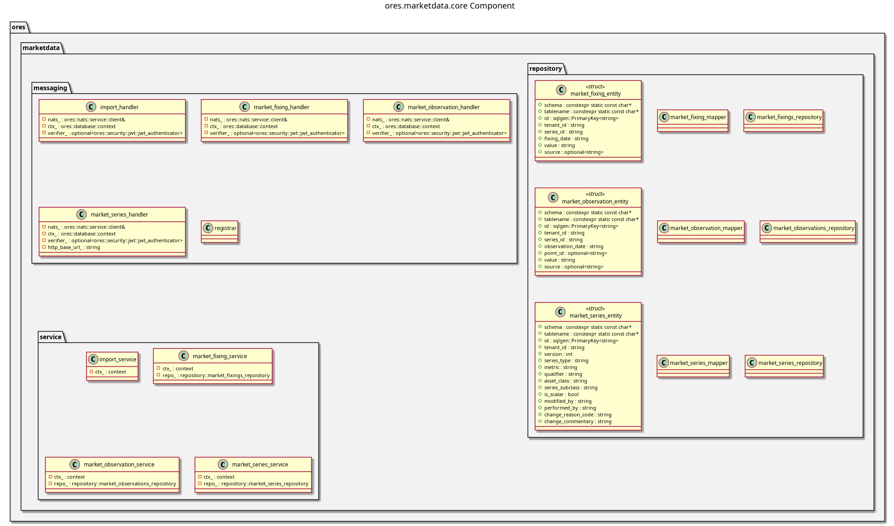

:PROPERTIES:
:ID: 759530D8-2314-44F3-A50E-71CE7AD02558
:END:
#+title: ores.marketdata.core
#+name: marketdata.core
#+full_name: ores.marketdata.core
#+description: Market data management — market series, observations, fixings, and import from external sources.
#+type: ores.codegen.component
#+level: cross
#+filetags: :marketdata:core:component:
#+created: 2026-05-19
#+updated: 2026-05-19

* Diagram

#+attr_html: :width 100% :alt ores.marketdata.core component diagram
#+caption: ores.marketdata.core

* Summary

=ores.marketdata.core= manages market data for ORE Studio: time series of
market observations (prices, rates, fixings), series metadata, and import from
external sources. It exposes NATS handlers for querying and importing market
data, and provides the data used by =ores.reporting.core= when constructing
ORE market data files for risk runs.

* Inputs

- NATS request messages for market series, observation, and fixing queries.
- External market data imported via =import_service= (CSV, API feeds).
- PostgreSQL connections to =ores_marketdata_*= tables.

* Outputs

- Market series, observation, and fixing records persisted to the
  =ores_marketdata= schema.
- NATS response messages returned to callers.

* Entry points

- =include/ores.marketdata.core/messaging/registrar.hpp= — registers handlers.
- =include/ores.marketdata.core/service/= — series, observation, fixing, import
  services.

* Dependencies

- =ores.marketdata.api= — shared domain types and NATS protocol schemas.
- =ores.dq=, =ores.iam.core=, =rfl=, =soci=, =nats.c=.

* See also

- [[id:6A62D943-FAC9-4B77-9E22-F265557DCF1A][ores.marketdata.api]] — protocol types and domain entities.
- [[id:57182ECE-6364-421A-A46F-73841F9961B4][ores.marketdata.service]] — NATS service entrypoint.
