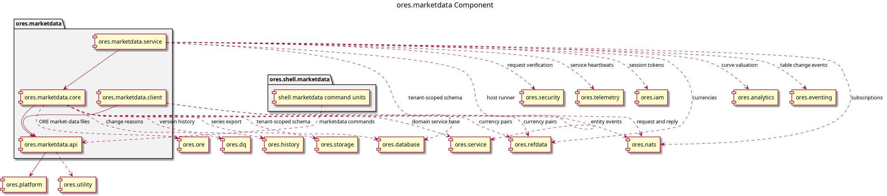

:PROPERTIES:
:ID: F2FA516C-1F86-43EF-80D4-E92F640B6CFD
:END:
#+title: ores.marketdata
#+description: Market data component: market series, observations, fixings, feed bindings and their oresmd representation, with NATS services.
#+type: ores.codegen.component
#+level: cross
#+filetags: :marketdata:component:
#+created: 2026-09-27
#+updated: 2026-09-27
#+name: marketdata
#+full_name: ores.marketdata
#+brief: Market data component
#+component_kind: composite
#+parts: api client core service

* Summary

=ores.marketdata= owns the market data the platform quotes against: the
series that name a curve, surface or fixing, the observations and fixings
that fill it, and the feed bindings that say where it comes from. It
represents ORE market data in an ORE Studio native form through =oresmd=,
an identifier grammar and projection layer covering every series type ORE's
shape table defines, and it imports the ORE-format files themselves.
Structured as a composite component with four sub-components.

* Sub-components

| Sub-component | Brief |
|---------------+-------|
| [[id:6A62D943-FAC9-4B77-9E22-F265557DCF1A][ores.marketdata.api]] | Domain types and NATS protocol schemas for the market-data component. |
| [[id:EBFDA8AD-34C6-4A28-AAB2-89FD3D3E9808][ores.marketdata.client]] | Client-side NATS wrapper for the marketdata service: request/response helpers and market data subscriptions. |
| [[id:759530D8-2314-44F3-A50E-71CE7AD02558][ores.marketdata.core]] | Market data management — market series, observations, fixings, and import from external sources. |
| [[id:57182ECE-6364-421A-A46F-73841F9961B4][ores.marketdata.service]] | NATS service entrypoint for the market-data domain. |

* Diagram

#+attr_html: :width 100% :alt ores.marketdata component diagram
#+caption: ores.marketdata

* Inputs

- ORE-format market data files, parsed at the import boundary.
- Market series, observation and fixing writes over the NATS protocol.

* Outputs

- Persisted market series, observations and fixings, with row-level history.
- Canonical entity events on the per-entity NATS subjects.
- An oresmd-native identifier for every series key the corpus carries.

* Entry points

- =include/ores.marketdata.api/=, =include/ores.marketdata.core/=,
  =include/ores.marketdata.client/=, =include/ores.marketdata.service/=.
- Subjects under =marketdata.v1.= and =history.v1.get=.

* Dependencies

- =ores.refdata= for currency-pair reference data during import.
- =ores.history= for the generic version-history dispatch.
- =ores.storage= for the market-series export to object storage.

* See also

- [[id:F9E8C6BE-9606-48E5-AEE3-431642C0EB28][Task: Bring ores.marketdata to the clean standard]].
