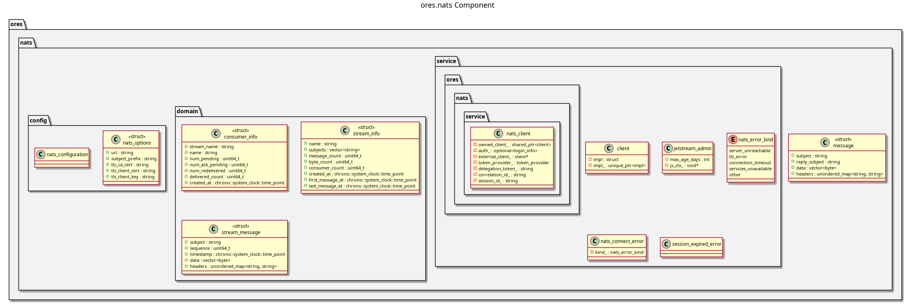

:PROPERTIES:
:ID: C9C24C99-F16C-45BE-A262-1C0F4502765E
:END:
#+title: ores.nats
#+description: NATS messaging transport library providing request/reply, pub/sub, and domain-event patterns using JSON via rfl.
#+type: ores.codegen.component
#+level: cross
#+filetags: :nats:messaging:component:
#+created: 2026-05-20
#+updated: 2026-05-20
#+name: nats
#+full_name: ores.nats
#+brief: NATS messaging foundation library

* Diagram

#+attr_html: :width 100% :alt ores.nats component diagram
#+caption: ores.nats

* Summary

=ores.nats= is the NATS messaging transport library for ORE Studio. It provides
the three messaging patterns used across all services: synchronous request/reply,
queue-group subscribe for load-balanced handlers, and JetStream for durable event
streams. All payloads are JSON serialised with =rfl::json=. Subject names follow
the convention ={domain}.v1.{entity}.{operation}=, with an optional prefix for
multi-instance deployments. This library replaced the former binary protocol
stack (=ores.comms=) and is a direct dependency of every domain service.

* Inputs

- NATS server URL and optional subject prefix from configuration.
- JSON-encoded request messages from clients or other services.
- JetStream stream/consumer configuration for durable event subscriptions.

* Outputs

- JSON-encoded reply messages sent to the caller's reply subject.
- Queue-group subscriptions delivering messages to exactly one handler instance.
- JetStream published messages and consumer acknowledgements.

* Entry points

- =include/ores.nats/service/nats_client.hpp= — connection and request/reply.
- =include/ores.nats/service/jetstream_admin.hpp= — stream and consumer management.
- =include/ores.nats/service/subscription.hpp= — queue-group subscribe.
- =include/ores.nats/domain/message.hpp= — NATS message and correlation types.
- =include/ores.nats/config/= — =nats_options= and CLI argument parsing.

* Dependencies

- =nats.c= — C NATS client library.
- =rfl= — JSON serialisation for message payloads.
- =ores.logging= — structured logging.

* See also

- [[id:D9B0988E-D783-43D6-BCCD-CE2F70022B9C][NATS]] — the upstream messaging technology: subjects, wildcards, queue
  groups, JetStream, NKey/JWT security.
- [[id:A7B3C9D2-E5F1-4A8B-9C6D-3E2F1A0B8C7D][ORE Studio Messaging Reference]] — index of every service's subject
  namespace and links to per-service messaging references.
