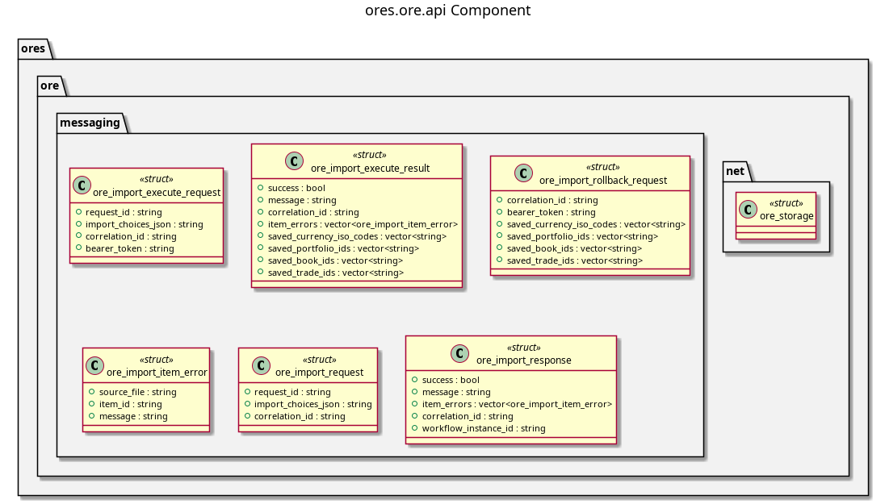

:PROPERTIES:
:ID: 0F93B352-F234-4D9D-82E6-05218BE645E8
:END:
#+title: ores.ore.api
#+description: Domain types and NATS protocol schemas for the ORE integration component.
#+type: ores.codegen.component
#+level: cross
#+filetags: :ore:api:component:
#+created: 2026-05-19
#+updated: 2026-05-19
#+name: ore.api
#+full_name: ores.ore.api
#+brief: ORE import API types and protocol

* Diagram

#+attr_html: :width 100% :alt ores.ore.api component diagram
#+caption: ores.ore.api

* Summary

=ores.ore.api= is a header-only library defining the shared contract for the
ORE integration domain. It provides domain types for ORE XML structures and
mappings, and the NATS protocol schemas consumed by =ores.ore.core= and Qt
clients that invoke ORE risk runs.

* Inputs

- Domain entity type definitions across =domain/= headers.

* Outputs

- C++ headers for ORE domain types with JSON I/O.
- NATS protocol headers for ORE invocation and result operations.

* Entry points

- =include/ores.ore.api/domain/= — all domain entity headers.
- =include/ores.ore.api/messaging/= — NATS protocol message headers.

* Dependencies

- =rfl= — JSON serialisation via reflection.

* See also

- [[id:9A71F1F5-C3ED-4C07-9D7D-C5B42D4A1332][ores.ore.core]] — ORE import/export logic and NATS handlers.
