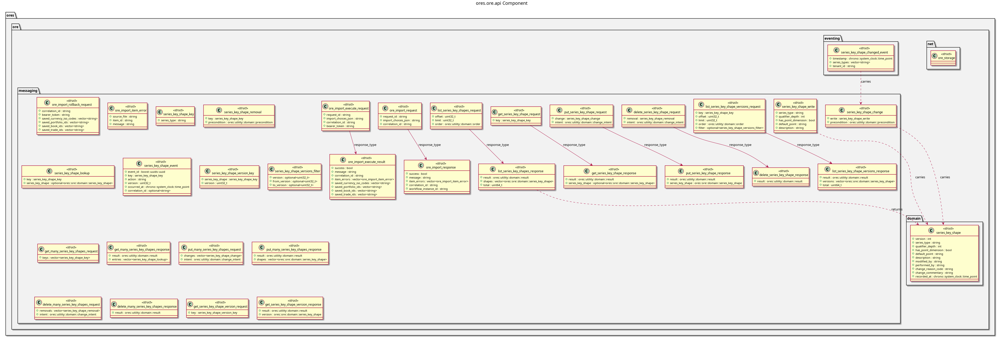

:PROPERTIES:
:ID: 0F93B352-F234-4D9D-82E6-05218BE645E8
:END:
#+title: ores.ore.api
#+description: The shared contract for the ORE integration component — the series key shape entity, plus the ORE import, saga-step and storage protocols.
#+type: ores.codegen.component
#+level: cross
#+filetags: :ore:api:component:
#+created: 2026-05-19
#+updated: 2026-09-26
#+name: ore.api
#+full_name: ores.ore.api
#+brief: ORE integration contract

* Diagram

#+attr_html: :width 100% :alt ores.ore.api component diagram
#+caption: ores.ore.api

* Summary

=ores.ore.api= is the shared contract of the component. It carries the
series key shape entity with its JSON I/O; the protocols for importing an
ORE directory, for the saga steps the engine drives, and for locating the
import tarball in object storage; and the workflow registration the ORE
import runs under.

The entity is the only part of the contract with no protocol of its own.
It is a reference table that =ores.marketdata= reads through the core's
repository, in process, so the model disables every facet that would build
a NATS surface, a shell command or a user interface for it. What the api
carries is the type the repository returns, not a surface.

It is a shared library, not a header-only one: the sources under =src/=
build =ores.ore.api.lib= and install it with a version.

* Inputs

- Entity rows, from the core's repository.
- Protocol requests for the ORE import, and workflow definitions the
  engine registers at startup.

* Outputs

- The entity type and its JSON serialisation, for the repository and the
  market data readers.
- The import, saga-step and storage protocol schemas consumed by
  =ores.ore.service= and the shell.

* Entry points

- =include/ores.ore.api/domain/= — the series key shape entity and its JSON I/O.
- =include/ores.ore.api/messaging/= — the import and saga-step protocols.
- =include/ores.ore.api/net/= — the import tarball bucket and key helpers.
- =include/ores.ore.api/workflow/= — the ORE import workflow registration.

* Dependencies

- =ores.platform=, =ores.storage=, =ores.logging=, =ores.workflow.api= and
  =ores.eventing.api= — linked publicly, so consumers inherit them.
- =ores.utility= — linked privately.

=ores.storage= is public because the import target helpers name a bucket,
so every consumer of this part inherits the object-storage client.

* See also

- [[id:9A71F1F5-C3ED-4C07-9D7D-C5B42D4A1332][ores.ore.core]] — the document engine behind this contract.
- [[id:EF8FD20D-0B9C-4379-8BBD-B4FCF2F5F0C7][ores.ore.service]] — the runnable host.
- [[id:5F280C8C-8C50-40A2-8C84-C85B8821D33E][ores.ore]] — the composite this part belongs to.
- [[id:8316E5A7-9BDA-4C88-856C-C933290F7396][ores.ore.series_key_shape]] — the entity this part carries, with no surface of its own.
- [[id:7302A9A4-8B64-4C92-8582-49FB5A2219A2][How do I round trip an ORE document through the database?]] — the import workflow this part declares.
