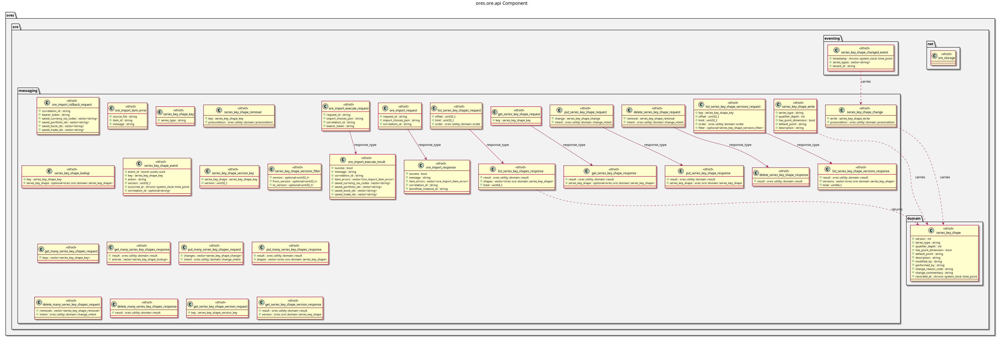

:PROPERTIES:
:ID: 0F93B352-F234-4D9D-82E6-05218BE645E8
:END:
#+title: ores.ore.api
#+description: The shared contract for the ORE integration component — the ORE import, saga-step and storage protocols.
#+type: ores.codegen.component
#+header_only: true
#+level: cross
#+filetags: :ore:api:component:
#+created: 2026-05-19
#+updated: 2026-09-26
#+name: ore.api
#+full_name: ores.ore.api
#+brief: ORE integration contract

* Diagram

#+attr_html: :width 100% :alt ores.ore.api component diagram
#+caption: ores.ore.api

* Summary

=ores.ore.api= is the shared contract of the component. It carries the
protocols for importing an ORE directory, for the saga steps the engine
drives, and for locating the import tarball in object storage; and the
workflow registration the ORE import runs under.

It is header-only: =ores.ore.api.lib= is an INTERFACE library that carries
its include path and the libraries its headers name, with no compiled body.

* Inputs

- Protocol requests for the ORE import, and workflow definitions the
  engine registers at startup.

* Outputs

- The import, saga-step and storage protocol schemas consumed by
  =ores.ore.service= and the shell.

* Entry points

- =include/ores.ore.api/messaging/= — the import and saga-step protocols.
- =include/ores.ore.api/net/= — the import tarball bucket and key helpers.
- =include/ores.ore.api/workflow/= — the ORE import workflow registration.

* Dependencies

- =ores.platform=, =ores.storage=, =ores.logging=, =ores.workflow.api= and
  =ores.eventing.api= — linked publicly, so consumers inherit them.
- =ores.utility= — linked privately.

=ores.storage= is public because the import target helpers name a bucket,
so every consumer of this part inherits the object-storage client.

* See also

- [[id:9A71F1F5-C3ED-4C07-9D7D-C5B42D4A1332][ores.ore.core]] — the document engine behind this contract.
- [[id:EF8FD20D-0B9C-4379-8BBD-B4FCF2F5F0C7][ores.ore.service]] — the runnable host.
- [[id:5F280C8C-8C50-40A2-8C84-C85B8821D33E][ores.ore]] — the composite this part belongs to.
- [[id:7302A9A4-8B64-4C92-8582-49FB5A2219A2][How do I round trip an ORE document through the database?]] — the import workflow this part declares.
